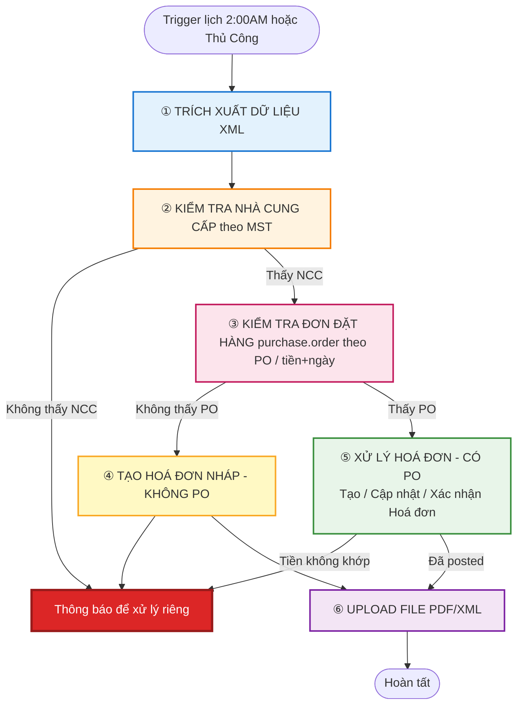
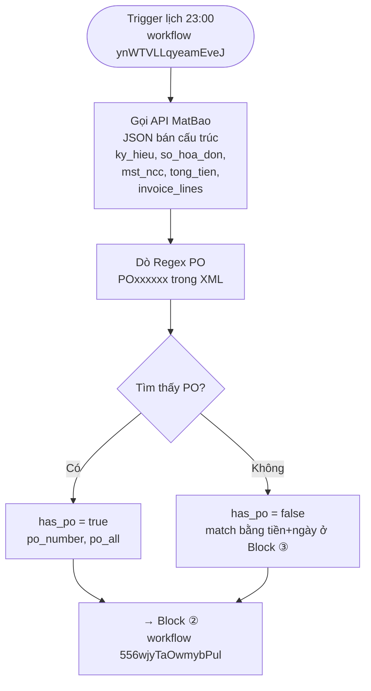
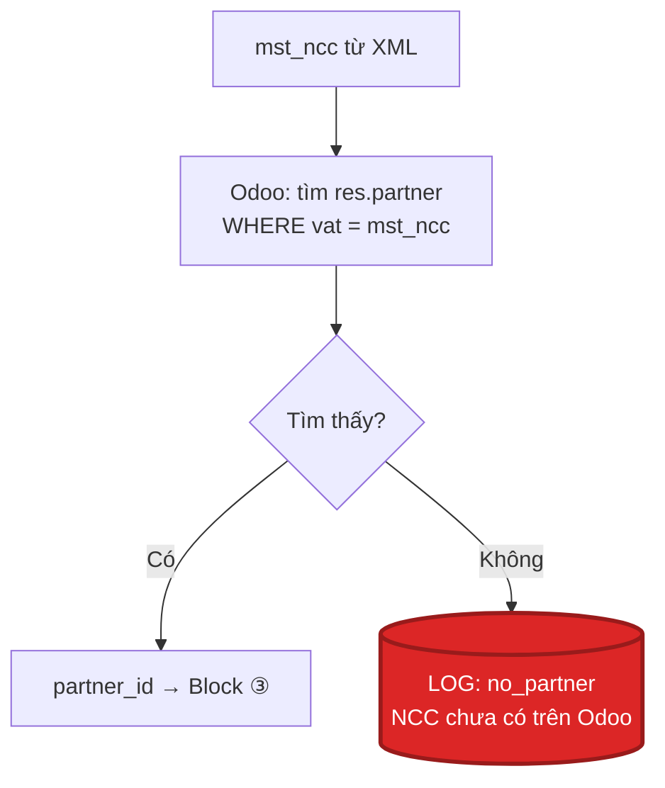
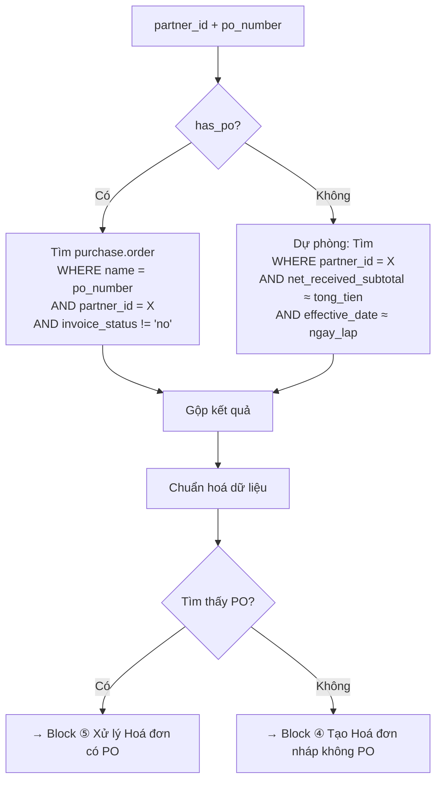
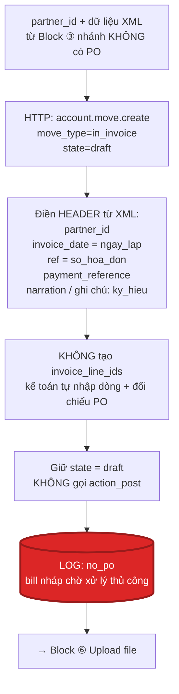
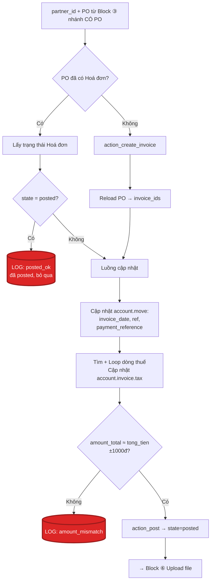
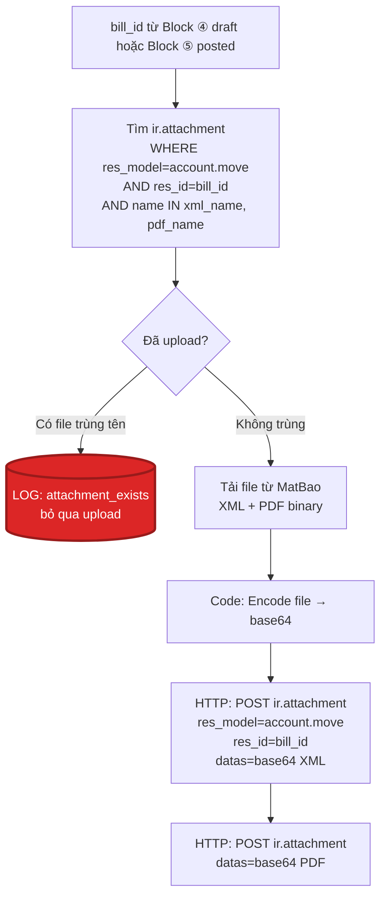
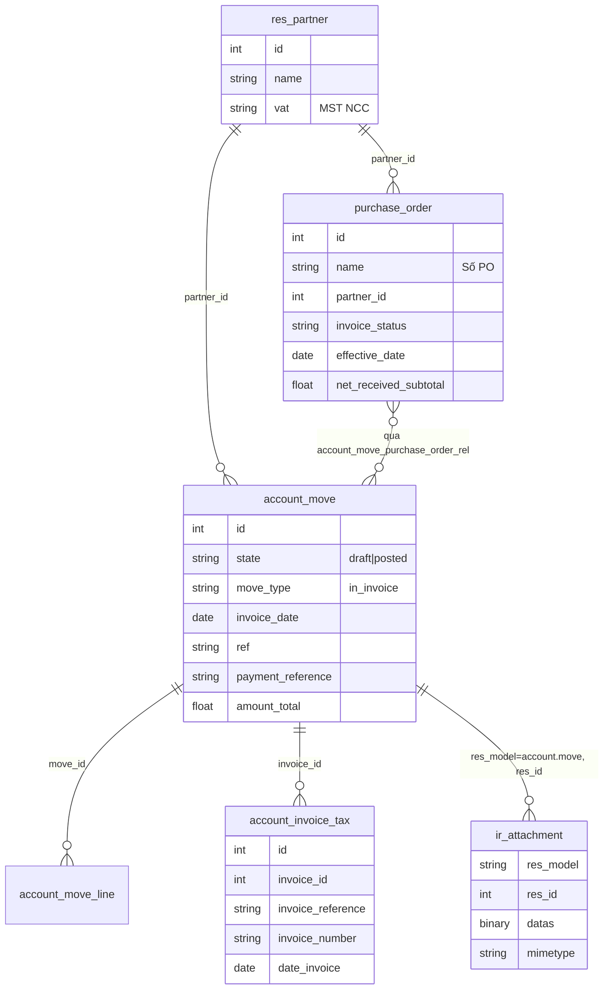

# Sơ đồ Workflow: XML → Hoá đơn NCC Odoo → Upload File

> Sơ đồ trực quan cho workflow [workflow-xml-to-odoo-vendor-bills.md](workflow-xml-to-odoo-vendor-bills.md)
> Workflow ID: `556wjyTaOwmybPul` — Phiên bản V8 (Tháng 4/2026)

---

## Workflow chia thành 6 Block

| # | Block | Mục đích |
|---|-------|----------|
| 1 | **Trích xuất dữ liệu XML** | Gọi API MatBao → nhận dữ liệu bán cấu trúc (JSON) của hoá đơn + dò số PO |
| 2 | **Kiểm tra Nhà cung cấp** | Tìm NCC trên Odoo theo MST (`res.partner.vat`) |
| 3 | **Kiểm tra Đơn đặt hàng (PO)** | Tìm PO trên Odoo theo số PO hoặc dự phòng theo tiền + ngày |
| 4 | **Tạo Hoá đơn nháp (Không PO)** | Tạo `account.move` chỉ phần header (không line item) → chờ kế toán xử lý thủ công |
| 5 | **Xử lý Hoá đơn (Có PO)** | Tạo / cập nhật / xác nhận Hoá đơn NCC (`account.move`) từ PO |
| 6 | **Upload file PDF/XML vào Hoá đơn** | Đính kèm file XML/PDF (tải từ MatBao) vào Hoá đơn qua `ir.attachment` |

---

## Toàn bộ quy trình (Flow Summary)

---

## Block ① Trích xuất dữ liệu XML

> **Workflow riêng:** `ynWTVLLqyeamEveJ` — chạy độc lập, xuất JSON cho workflow chính `556wjyTaOwmybPul` tiêu thụ.

**Workflow ID:** `ynWTVLLqyeamEveJ` (tách riêng khỏi workflow chính `556wjyTaOwmybPul`)
**Đầu vào:** API MatBao (thay thế cho việc đọc file XML từ SharePoint)
**Bước Regex:** quét text trong XML để tìm pattern `POxxxxxx` (PO + 6 chữ số trở lên) vì số PO không phải field chuẩn trong hoá đơn điện tử VN — NCC thường ghi vào `ghi_chu` / `ten_hang` / `dien_giai`
**Đầu ra:** JSON gồm metadata hoá đơn + cờ `has_po` → chuyển sang workflow chính (Block ② trở đi)
**2 nhánh đầu ra:**
- `has_po = true` → Block ③ match PO theo `name`
- `has_po = false` → Block ③ dự phòng match theo `tiền + ngày` (vẫn tiếp tục workflow, không DỪNG)

---

## Block ② Kiểm tra Nhà cung cấp

**Model:** `res.partner` | **Field khoá:** `vat` (MST NCC)
**Không có NCC:** ghi vào LOG để kế toán xem + tạo NCC thủ công — workflow dừng xử lý hoá đơn này

---

## Block ③ Kiểm tra Đơn đặt hàng

**Model:** `purchase.order` | **Field khoá:** `name`, `partner_id`, `invoice_status`

---

## Block ④ Tạo Hoá đơn nháp (Không PO)

**Model:** `account.move` | **Đầu ra:** `bill_id` ở trạng thái `draft`

**Mục đích:** đảm bảo mọi hoá đơn nhận từ MatBao đều có bản ghi tương ứng trên Odoo (kể cả khi chưa có PO), để:
- Đính kèm file XML/PDF gốc ngay ở Block ⑥ (không phải chờ kế toán tạo bill mới upload)
- Kế toán mở bill `draft` → bổ sung `invoice_line_ids` + chọn PO phù hợp → `action_post`

**Lưu ý:** Bill nháp này có `partner_id` + metadata header, KHÔNG có dòng → `amount_total = 0` ở thời điểm tạo. Tổng tiền thực tế từ XML (`tong_tien`) có thể lưu vào `narration` hoặc trường tham chiếu để kế toán đối chiếu.

---

## Block ⑤ Xử lý Hoá đơn (Có PO)

**Model:** `account.move` + `account.invoice.tax` | **Đầu ra:** `bill_id` đã `posted`

---

## Block ⑥ Upload file PDF/XML vào Hoá đơn

**Model:** `ir.attachment` (đa hình: `res_model=account.move`, `res_id=bill_id`)
**Bước Check trùng:** search `ir.attachment` theo `res_id = bill_id` và `name IN (xml_name, pdf_name)`
- Nếu đã tồn tại → log `attachment_exists`, bỏ qua upload (tránh duplicate khi workflow chạy lại)
- Nếu chưa có → tải từ MatBao + upload như bình thường

**Không còn di chuyển file trên SharePoint** — dữ liệu gốc nằm trên MatBao, workflow chỉ cần tải về + đính kèm vào Hoá đơn trên Odoo

---

## Quan hệ các Model trên Odoo

