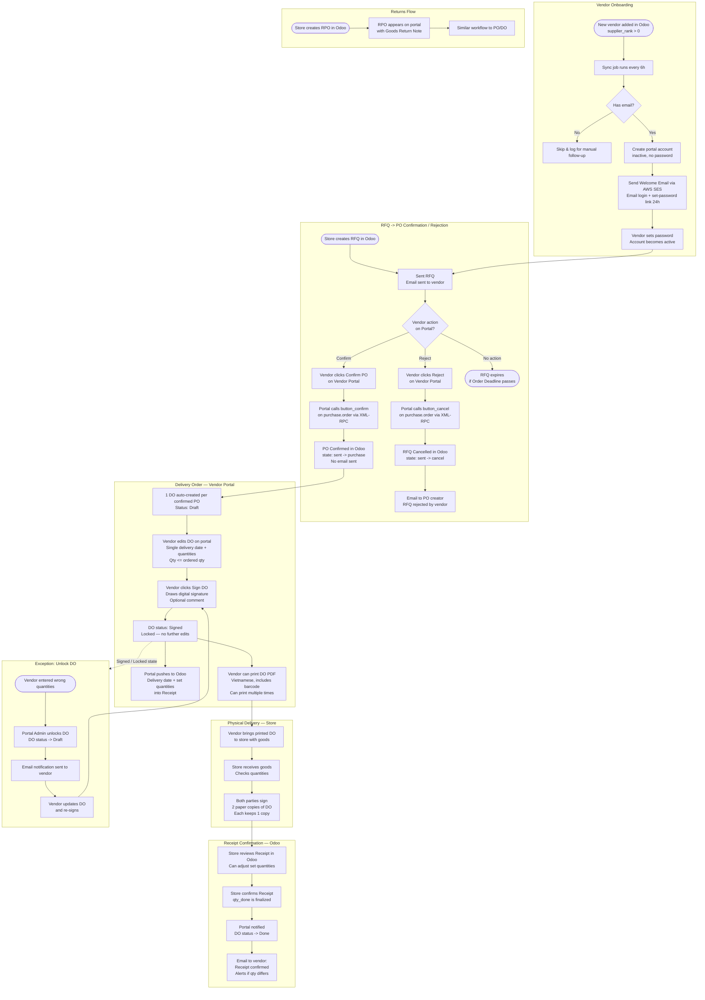
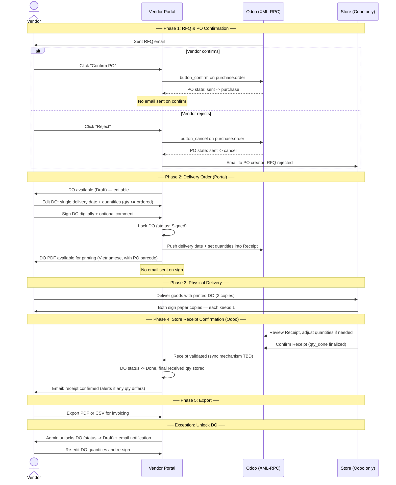
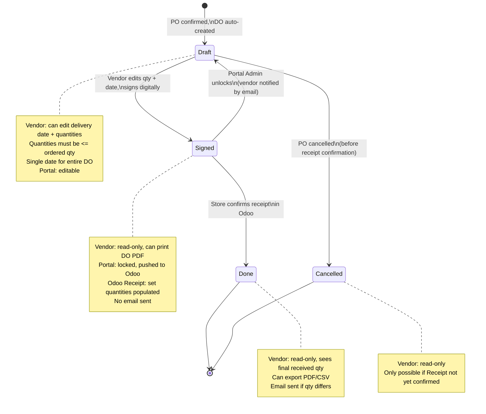

# 3SACH Vendor Portal — Process Flow

---

## Business Overview (Simple View)

```mermaid
flowchart LR
    classDef store    fill:#DBEAFE,stroke:#3B82F6,color:#1E3A5F,font-weight:bold
    classDef vendor   fill:#D1FAE5,stroke:#10B981,color:#064E3B,font-weight:bold
    classDef portal   fill:#EDE9FE,stroke:#7C3AED,color:#2E1065,font-weight:bold
    classDef internal fill:#FEF3C7,stroke:#F59E0B,color:#451A03,font-weight:bold
    classDef decision fill:#FFF,stroke:#6B7280,color:#111827

    S1([Store creates\nRFQ in Odoo]):::store
    S2([RFQ sent\nto vendor]):::store

    D1{Vendor confirms\nor rejects?}:::decision
    D1_NO([Vendor rejects RFQ\non Portal]):::vendor
    D1_CANCEL([Portal cancels RFQ\nin Odoo + email\nto PO creator]):::portal

    V1([Vendor confirms PO\non Portal]):::vendor
    V2([DO auto-created\nVendor edits qty + date]):::vendor
    V3([Vendor signs DO\ndigitally on Portal]):::vendor
    V4([Print DO PDF\nwith signature + barcode]):::vendor
    V5([Deliver goods\nto store with paper DO]):::vendor

    P1{{Portal pushes\nqty + date to Odoo\nReceipt}}:::portal

    I1([Store receives goods\nconfirms Receipt in Odoo]):::internal
    I2{{Portal notified\nDO status -> Done}}:::portal
    I3([Vendor sees final\nqty on Portal\nCan export PDF/CSV]):::vendor

    S1 --> S2 --> D1
    D1 -- Reject --> D1_NO --> D1_CANCEL
    D1 -- Confirm --> V1 --> V2 --> V3 --> V4 --> V5
    V3 --> P1
    V5 --> I1 --> I2 --> I3
```

> **Colours:** Blue = Store | Green = Vendor | Purple = Portal System | Yellow = Internal 3Sach

---

## Full Purchase Workflow: RFQ -> PO Confirm -> DO -> Delivery -> Receipt

---

## Swimlane View (4 Actors)

---

## PO Status Mapping: Portal vs Odoo

Portal and Odoo maintain **different status labels**. Odoo's base behaviour is never modified.

| Portal PO Status | Odoo State | Trigger | Vendor can do |
|---|---|---|---|
| **Waiting** | `sent` | Store sends RFQ | Confirm or Reject |
| **Confirmed** | `purchase` | Vendor confirms PO on portal | View DO, export data |
| **Cancelled** | `cancel` | Vendor rejects, or store cancels | Read-only |

---

## DO State Machine

---

## Returns: RPO & Goods Return Note

The portal supports returns via **Return Purchase Order (RPO)** and **Goods Return Note (GRN)**, mirroring the PO/DO flow.

| Concept | Purchase Flow | Returns Flow |
|---|---|---|
| Order | PO (Purchase Order) | RPO (Return Purchase Order) |
| Delivery document | DO (Delivery Order) | GRN (Goods Return Note) |
| Statuses | Same lifecycle | Same lifecycle |

> Detailed RPO/GRN workflow to be specified after core PO/DO flow is finalized.

---

## Data Retention

- Vendors can view PO data for **24 months** from PO creation date
- Applies to **all statuses** equally: Waiting, Confirmed, Cancelled
- Applies to **all DO statuses**: Draft, Signed, Done, Cancelled
- POs older than 24 months are **permanently deleted** from the portal database
- A scheduled cleanup job runs periodically to enforce this rule

---

## Data Export

- Vendors can export data as **PDF** or **CSV**
- Scope: PO number, DO quantities, receipt quantities, delivery date, receipt confirmation date
- Date range filter available
- Includes both regular POs/DOs and returns (RPO/GRN)

---

**Glossary**

| Term | Meaning |
|---|---|
| NCC | Nhà cung cấp (Vendor) |
| DO | Delivery Order — vendor's planned delivery document, edited and signed on portal |
| GRN | Goods Return Note — return equivalent of DO |
| Receipt | Phiếu nhập kho — Odoo's incoming shipment record, confirmed by store |
| RPO | Return Purchase Order — return equivalent of PO |
| SL | Số lượng (Quantity) |
| RFQ | Request for Quotation |
| PO | Purchase Order |
| Set Quantities | Pre-filled quantities in Odoo Receipt from vendor's DO (not yet qty_done) |
| qty_done | Final received quantity, set only when store confirms Receipt in Odoo |
