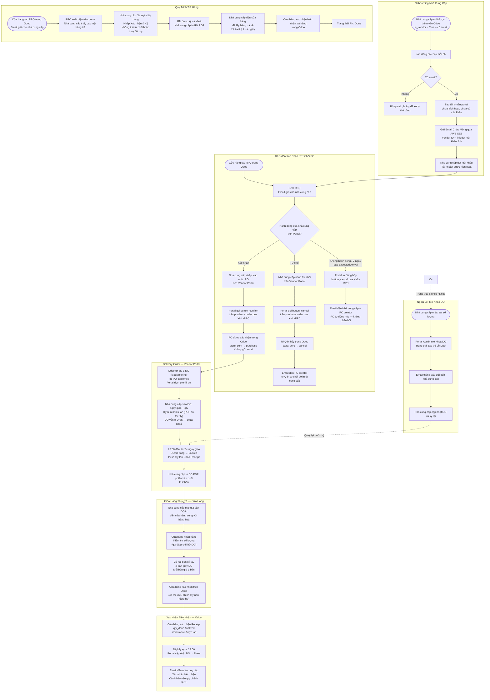
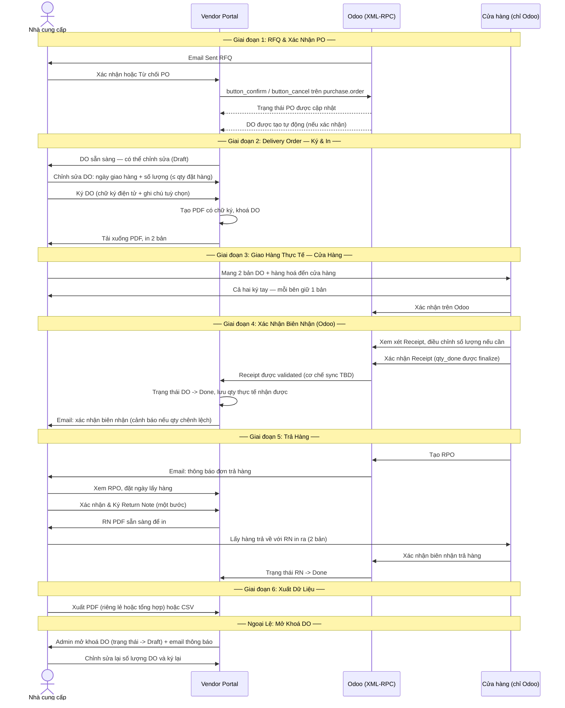
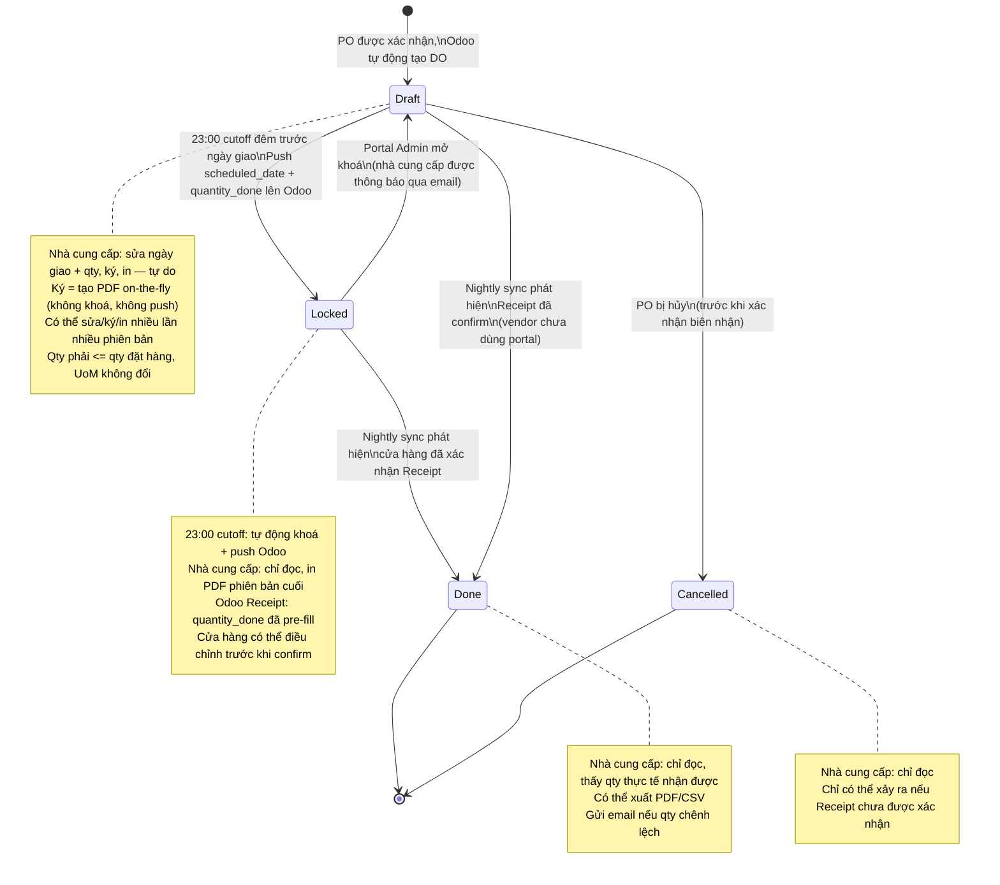
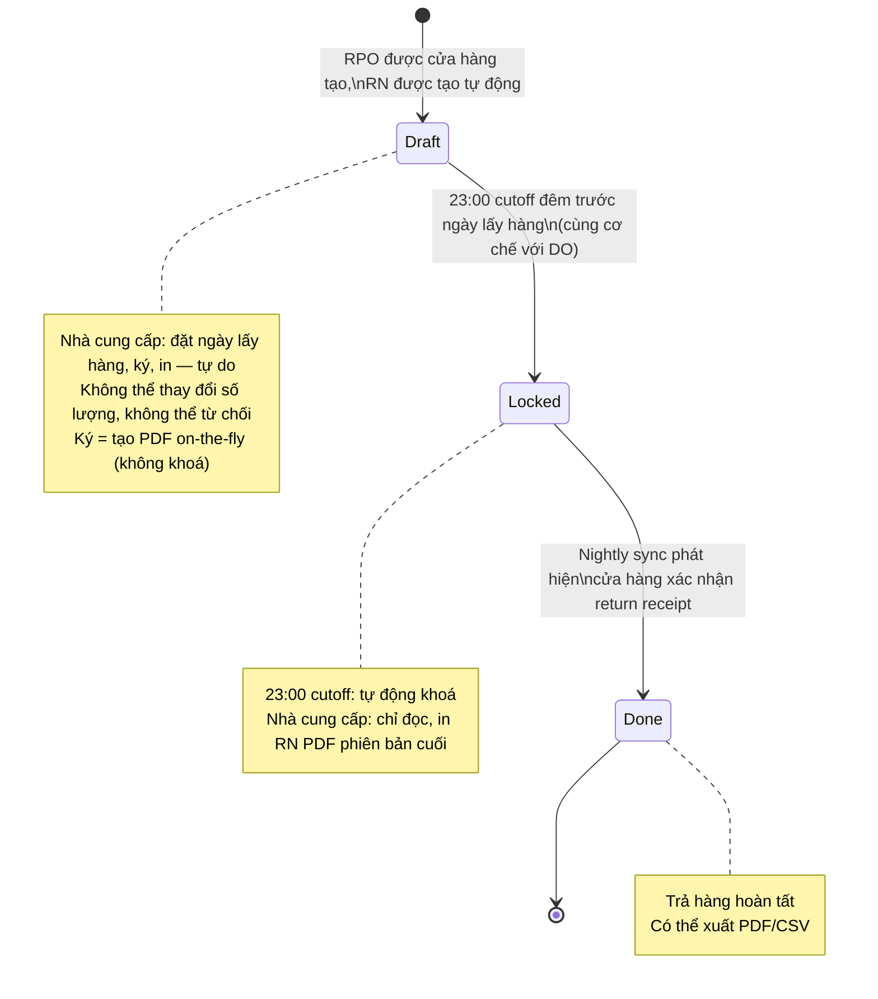

# 3SACH Vendor Portal — Luồng Quy Trình

---

## Tổng Quan Nghiệp Vụ (Nhìn Đơn Giản)

```mermaid
flowchart LR
    classDef store    fill:#DBEAFE,stroke:#3B82F6,color:#1E3A5F,font-weight:bold
    classDef vendor   fill:#D1FAE5,stroke:#10B981,color:#064E3B,font-weight:bold
    classDef portal   fill:#EDE9FE,stroke:#7C3AED,color:#2E1065,font-weight:bold
    classDef internal fill:#FEF3C7,stroke:#F59E0B,color:#451A03,font-weight:bold

    S1([🏪 Cửa hàng\ntạo RFQ\ntrên Odoo]):::store
    S2([📧 Gửi RFQ\ncho nhà cung cấp]):::store

    V1([✅ Nhà cung cấp\nxác nhận PO\ntrên Portal]):::vendor
    P_DO([🔄 Odoo tự tạo DO\ndựa trên PO đã confirmed]):::portal
    V2([📦 Điền số lượng\nvà ngày giao\ntrên Portal]):::vendor
    V3([✍️ Ký xác nhận DO\ntrên Portal\nvà tải PDF]):::vendor
    V4([🚚 Cầm 2 tờ DO\nra cửa hàng]):::vendor

    P1{{Portal tạo\nPDF có chữ ký}}:::portal

    I1([🏪 Cửa hàng ký\nphysically 2 tờ DO\nmỗi bên giữ 1 tờ]):::store
    I2([✔️ Cửa hàng\nxác nhận\ntrên Odoo]):::store

    S1 --> S2 --> V1
    V1 --> P_DO --> V2
    V2 --> V3
    V3 --> P1
    P1 --> V4
    V4 --> I1
    I1 --> I2
    I2 --> DONE([🎉 Hoàn tất]):::store
```

> **Màu sắc:** 🔵 Xanh dương = Cửa hàng | 🟢 Xanh lá = Nhà cung cấp | 🟣 Tím = Hệ thống Portal | 🟡 Vàng = Nội bộ 3Sach

---

## Toàn Bộ Quy Trình Mua Hàng: RFQ -> Xác Nhận PO -> DO -> Giao Hàng -> Biên Nhận

---

## Sơ Đồ Swimlane (4 Bên Tham Gia)

---

## Luồng Xác Thực

### Xác Thực Nhà Cung Cấp
1. Nhà cung cấp nhập **Vendor ID** (số nguyên — `res.partner.id` từ Odoo) và mật khẩu trên trang đăng nhập
2. Backend tra cứu `vendor_users` theo `odoo_partner_id`; xác minh bcrypt luôn chạy (kể cả khi ID không tồn tại — an toàn về mặt timing)
3. Cùng một thông báo lỗi chung cho cả sai ID lẫn sai mật khẩu — không tiết lộ ID có tồn tại hay không
4. Thành công: cấp phát **JWT access token** (30 phút) và **refresh token** (7 ngày), cả hai đều mang `role: vendor`
5. Tất cả các request tiếp theo mang access token trong header `Authorization`
6. Khi nhận 401: frontend gọi thầm `/api/auth/refresh` → thử lại một lần với token mới
7. Khi refresh thất bại: xóa storage → chuyển hướng về `/login`

### Xác Thực Admin
- Admin đăng nhập tại `/admin/login` với **username** (không phải Vendor ID) và mật khẩu
- JWT mang `role: admin` — token admin không thể truy cập route vendor và ngược lại
- Tài khoản admin đầu tiên được seed từ biến môi trường `ADMIN_INITIAL_PASSWORD` khi khởi động

### Token Blacklist
- Khi đăng xuất, refresh token được thêm vào Redis với TTL khớp với thời gian còn lại của token

---

## Thông Báo Email

| Sự kiện | Người nhận | Ngôn ngữ | Nội dung |
|---|---|---|---|
| Tài khoản vendor mới được tạo (job đồng bộ) | Nhà cung cấp | Tiếng Việt (mặc định) | Vendor ID (số nguyên) + link đặt mật khẩu (hết hạn sau 24h) |
| Yêu cầu đặt lại mật khẩu | Nhà cung cấp | Ngôn ngữ ưa thích của nhà cung cấp | Link đặt lại (hết hạn sau 24h) |
| RFQ bị từ chối bởi nhà cung cấp | PO creator (nhân viên cửa hàng) | Tiếng Việt | Mã RFQ, tên nhà cung cấp |
| PO tự động hủy (7 ngày sau Expected Arrival) | Nhà cung cấp + PO creator | Ngôn ngữ ưa thích / Tiếng Việt | PO tự động hủy — không phản hồi trong 7 ngày |
| DO được ký bởi nhà cung cấp | — | — | Không gửi email khi ký |
| Biên nhận được cửa hàng xác nhận (qty khớp) | Nhà cung cấp | Ngôn ngữ ưa thích của nhà cung cấp | Xác nhận kèm số PO, mã biên nhận |
| Biên nhận được cửa hàng xác nhận (qty chênh lệch) | Nhà cung cấp | Ngôn ngữ ưa thích của nhà cung cấp | Cảnh báo kèm chi tiết chênh lệch |
| DO được admin mở khoá | Nhà cung cấp | Ngôn ngữ ưa thích của nhà cung cấp | Thông báo DO đã sẵn sàng để chỉnh sửa lại |

> Tất cả email gửi đến nhà cung cấp tuân theo `vendor_users.preferred_language` (`vi` hoặc `en`). Email nội bộ luôn bằng tiếng Việt. Gửi email qua **AWS SES** với IAM user chuyên dụng (chỉ có quyền `ses:SendEmail`).

---

## Quyền Hạn Admin

Portal admin dùng chung bố cục giao diện với nhà cung cấp và có thêm các mục menu: **Nhà cung cấp**, **Trạng thái Sync**, **Audit Log**.

| Quyền hạn | Endpoint |
|---|---|
| Xem toàn bộ tài khoản nhà cung cấp (trạng thái, lần đăng nhập cuối, số biên nhận) | `GET /api/admin/vendors` |
| Xem chi tiết PO và biên nhận của một nhà cung cấp cụ thể | `GET /api/admin/vendors/{partner_id}` |
| Kích hoạt / vô hiệu hoá tài khoản nhà cung cấp | `PATCH /api/admin/vendors/{partner_id}/deactivate|reactivate` |
| Tải xuống PDF đã ký của bất kỳ nhà cung cấp nào | `GET /api/admin/delivery-orders/{do_id}/pdf` |
| Mở khoá DO đã ký (nhà cung cấp có thể chỉnh sửa và ký lại) | `POST /api/admin/delivery-orders/{do_id}/unlock` |
| Kích hoạt thủ công job đồng bộ partner Odoo | `POST /api/admin/sync` |
| Xem trạng thái sync (lần chạy cuối, số vendor đã sync, số bị bỏ qua) | `GET /api/admin/sync/status` |
| Xem audit log có phân trang | `GET /api/admin/audit-log` |

**Audit log** ghi lại các loại hành động: `login`, `po_confirm`, `po_reject`, `po_auto_cancel`, `do_update`, `do_sign`, `do_unlock`, `rn_confirm_sign`, `receipt_validated`. Chỉ được ghi thêm — không thể chỉnh sửa hoặc xoá qua portal.

**Không thể chỉnh sửa hồ sơ trong portal.** Mọi thay đổi hồ sơ nhà cung cấp (tên, email, điện thoại, công ty) phải thực hiện trong Odoo và sẽ được đồng bộ trong chu kỳ 6 giờ tiếp theo. Admin không thể chỉnh sửa hồ sơ nhà cung cấp trực tiếp.

---

## Ánh Xạ Trạng Thái PO: Portal vs Odoo

Portal và Odoo duy trì **nhãn trạng thái khác nhau**. Hành vi gốc của Odoo không bao giờ bị thay đổi.

| Trạng thái PO trên Portal | Trạng thái Odoo | Điều kiện kích hoạt | Nhà cung cấp có thể làm |
|---|---|---|---|
| **Waiting** | `sent` | Cửa hàng gửi RFQ | Xác nhận hoặc Từ chối |
| **Confirmed** | `purchase` | Nhà cung cấp xác nhận PO trên portal | Xem DO, xuất dữ liệu |
| **Cancelled** | `cancel` | Nhà cung cấp từ chối, cửa hàng hủy, hoặc tự động hủy (7 ngày sau Expected Arrival) | Chỉ đọc |

---

## State Machine của DO

---

## State Machine của RN (Return Note)

---

## Trả Hàng: RPO & Return Note (Biên Bản Trả Hàng)

| Khái niệm | Quy trình mua hàng | Quy trình trả hàng |
|---|---|---|
| Đơn hàng | PO (Purchase Order) | RPO (Return Purchase Order) |
| Chứng từ giao nhận | DO (Delivery Order) | RN (Return Note / Biên Bản Trả Hàng) |
| Nhà cung cấp có thể chỉnh sửa | Ngày giao hàng + số lượng (không phải UoM) | Chỉ ngày lấy hàng (không thay đổi qty hay UoM) |
| Nhà cung cấp có thể từ chối | Có | Không |
| Chữ ký | Bắt buộc (DO) | Bắt buộc (RN) |
| PDF có thể in | Có (DO PDF) | Có (RN PDF, cùng định dạng) |
| Trao đổi vật lý | Nhà cung cấp giao hàng đến cửa hàng | Nhà cung cấp lấy hàng từ cửa hàng |

---

## Lưu Trữ Dữ Liệu

- Nhà cung cấp có thể xem dữ liệu PO trong **24 tháng** kể từ ngày tạo PO
- Áp dụng cho **tất cả trạng thái PO**: Waiting, Confirmed, Cancelled
- Áp dụng cho **tất cả trạng thái DO**: Draft, Signed, Done, Cancelled
- Áp dụng cho trả hàng (RPO/RN) như nhau
- PO cũ hơn 24 tháng bị **xoá vĩnh viễn** khỏi cơ sở dữ liệu portal
- Một scheduled cleanup job chạy định kỳ để thực thi quy tắc này

---

## Xuất Dữ Liệu

- Nhà cung cấp có thể xuất dữ liệu dưới dạng **PDF** hoặc **CSV**
- PDF: chứng từ riêng lẻ hoặc báo cáo tổng hợp nhiều bản ghi
- CSV: dữ liệu hàng loạt để nhà cung cấp chỉnh sửa và nhập vào hệ thống của họ
- Giao diện hỗ trợ chọn một hoặc nhiều bản ghi để xuất
- Có bộ lọc theo khoảng ngày
- Bao gồm cả PO/DO thông thường lẫn trả hàng (RPO/RN)

---

**Bảng Thuật Ngữ**

| Thuật ngữ | Ý nghĩa |
|---|---|
| NCC | Nhà cung cấp (Vendor) |
| DO | Delivery Order — chứng từ giao hàng theo kế hoạch của nhà cung cấp, được chỉnh sửa và ký trên portal |
| RN | Return Note / Biên Bản Trả Hàng — tương đương DO cho quy trình trả hàng, được nhà cung cấp ký |
| Receipt | Phiếu nhập kho — bản ghi hàng nhập trong Odoo, được xác nhận bởi cửa hàng |
| RPO | Return Purchase Order — tương đương PO cho quy trình trả hàng, do cửa hàng tạo |
| SL | Số lượng (Quantity) |
| RFQ | Request for Quotation |
| PO | Purchase Order |
