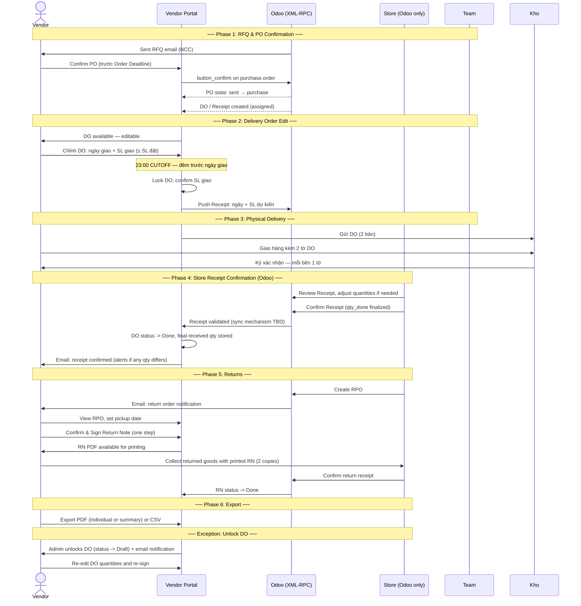
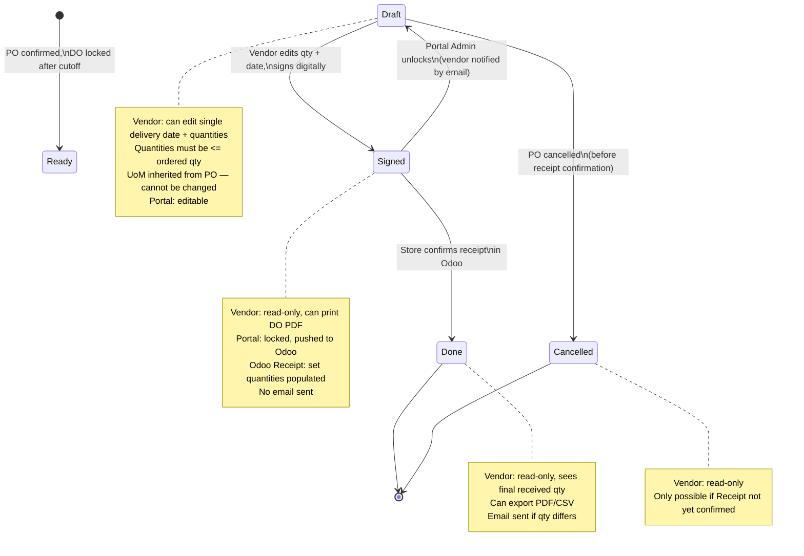
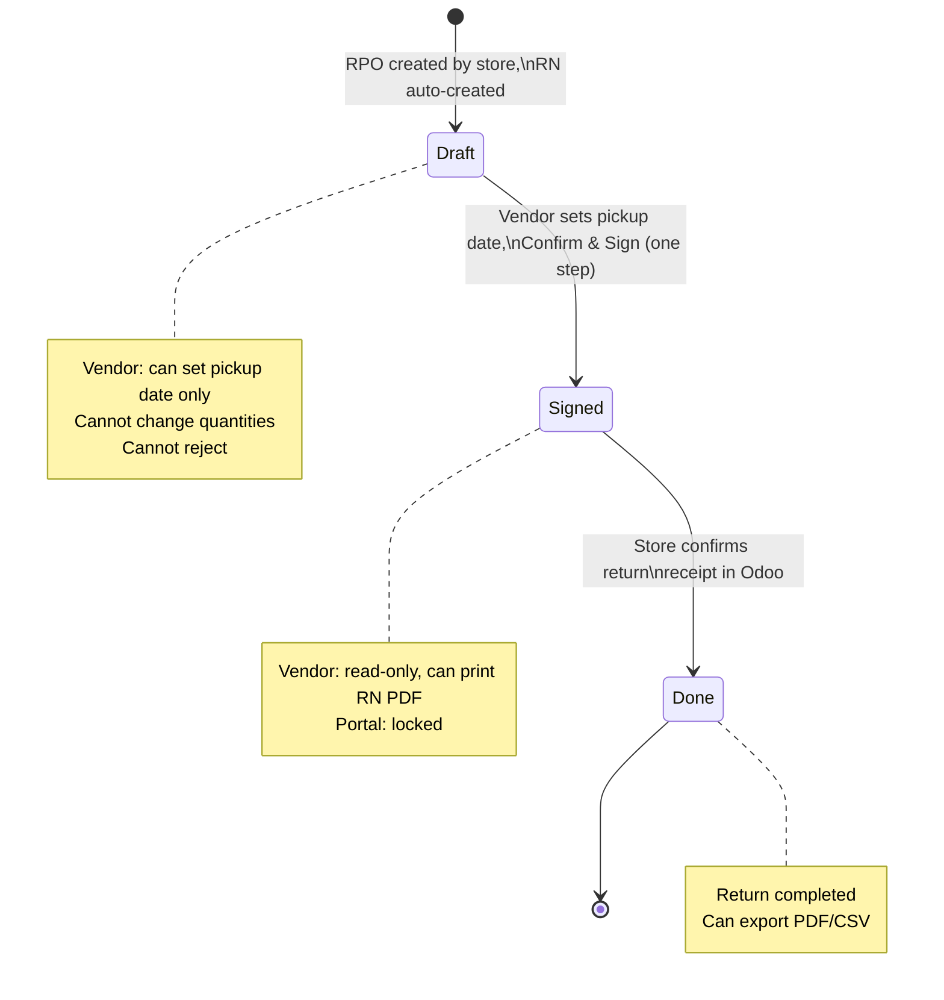

# 3SACH Vendor Portal — Process Flow

---

## Business Overview (Simple View)

```mermaid
flowchart LR
    classDef store    fill:#DBEAFE,stroke:#3B82F6,color:#1E3A5F,font-weight:bold
    classDef vendor   fill:#D1FAE5,stroke:#10B981,color:#064E3B,font-weight:bold
    classDef portal   fill:#EDE9FE,stroke:#7C3AED,color:#2E1065,font-weight:bold
    classDef internal fill:#FEF3C7,stroke:#F59E0B,color:#451A03,font-weight:bold
    classDef decision fill:#FFF,stroke:#6B7280,color:#111827

    S1([🏪 Cửa hàng\ntạo RFQ\ntrên Odoo]):::store
    S2([📧 Gửi RFQ\ncho nhà cung cấp]):::store

    V1([✅ Nhà cung cấp\nxác nhận PO\ntrên Portal]):::vendor
    V2([📦 Điền số lượng\nvà ngày giao\ntrên Portal]):::vendor
    V3([🚚 Giao hàng\nthực tế\ncho kho]):::vendor
    V4([✍️ Ký xác nhận\ntrên Portal\nvà tải PDF]):::vendor

    P1{{Portal tự động\nkhoá DO\nlúc 23:00}}:::portal
    P2{{Portal tạo\nPDF có chữ ký\nvà gửi email}}:::portal

    I1([🔍 Nội bộ\nkiểm tra\nsố lượng]):::internal
    I2([✔️ Xác nhận\nnhập kho\ntrên Odoo]):::internal

    S1 --> S2 --> V1
    V1 --> V2
    V2 --> P1
    P1 --> V3
    V3 --> V4
    V4 --> P2
    P2 --> I1
    I1 --> I2
    I2 --> DONE([🎉 Hoàn tất]):::store
```



> **Colours:** 🔵 Blue = Store | 🟢 Green = Vendor | 🟣 Purple = Portal System | 🟡 Yellow = Internal 3Sach

---

## Full Purchase Workflow: RFQ -> PO Confirm -> DO -> Delivery -> Receipt

```mermaid
flowchart TD
    subgraph ONBOARD["Vendor Onboarding"]
        A1(["New vendor added in Odoo\nsupplier_rank > 0"]) --> A2[Sync job runs every 6h]
        A2 --> A3{Has email?}
        A3 -- No --> A4[Skip & log for manual follow-up]
        A3 -- Yes --> A5["Create portal account\ninactive, no password"]
        A5 --> A6["Send Welcome Email via AWS SES\nVendor ID + set-password link 24h"]
        A6 --> A7["Vendor sets password\nAccount becomes active"]
    end

<<<<<<< HEAD:PROCESS_FLOW_backup.md
    subgraph RFQ_PO["RFQ to PO Confirmation / Rejection"]
        B1(["Store creates RFQ in Odoo"]) --> B2["Sent RFQ\nEmail sent to vendor"]
        B2 --> B3{"Vendor action\non Portal?"}
        B3 -- Confirm --> B4["Vendor clicks Confirm PO\non Vendor Portal"]
        B4 --> B5["Portal calls button_confirm\non purchase.order via XML-RPC"]
        B5 --> B6["PO Confirmed in Odoo\nstate: sent to purchase\nNo email sent"]
        B3 -- Reject --> B7["Vendor clicks Reject\non Vendor Portal"]
        B7 --> B8["Portal calls button_cancel\non purchase.order via XML-RPC"]
        B8 --> B9["RFQ Cancelled in Odoo\nstate: sent to cancel"]
        B9 --> B10["Email to PO creator\nRFQ rejected by vendor"]
        B3 -- No action / 7 days past Expected Arrival --> B3X["Portal auto-cancels\nbutton_cancel via XML-RPC"]
        B3X --> B3Y["Email to Vendor + PO creator\nPO auto-cancelled — no response"]
    end

    subgraph DO["Delivery Order — Vendor Portal"]
        C1["1 DO auto-created per confirmed PO\nStatus: Draft"] --> C2["Vendor edits DO on portal\nSingle delivery date + quantities\nQty must not exceed ordered qty\nDelivery qty always in base UoM"]
        C2 --> C3["Vendor clicks Sign DO\nDraws digital signature\nOptional comment\nQty only — cannot change UoM"]
        C3 --> C4["DO status: Signed\nLocked — no further edits"]
        C4 --> C5["Portal pushes to Odoo\nDelivery date + set quantities\ninto Receipt"]
        C4 --> C6["Vendor can print DO PDF\nVietnamese, PO as Code128 barcode\nCan print multiple times"]
    end

    subgraph DELIVERY["Physical Delivery — Store"]
        D1["Vendor brings printed DO\nto store with goods"] --> D2["Store receives goods\nChecks quantities"]
        D2 --> D3["Both parties sign\n2 paper copies of DO\nEach keeps 1 copy"]
=======
    subgraph RFQ_PO["🟨 RFQ → PO Confirmation  ·  Cửa hàng / Vendor Portal"]
        B1([Cửa hàng tạo RFQ trên Odoo]) --> B2[Sent RFQ\nEmail gửi cho NCC]
        B2 --> B3{Vendor xác nhận PO\ntrước Order Deadline?}
        B3 -- No --> B3X([PO không được xác nhận\nRFQ hết hạn])
        B3 -- Yes --> B4[Vendor clicks 'Confirm PO'\non Vendor Portal]
        B4 --> B5[Portal calls button_confirm\non purchase.order via XML-RPC]
        B5 --> B6[PO Confirmed\nOdoo cập nhật trạng thái: sent → purchase]
    end

    subgraph DO["🟧 Delivery Order  ·  Vendor Portal"]
        C1[DO sinh ra tự động\nIn và sửa được] --> C2[NCC chỉnh DO trên portal\nNgày giao + số lượng\nSL giao ≤ SL đặt]
        C2 --> C3{Trước 23:00\nđêm trước ngày giao?}
        C3 -- Yes --> C4[DO vẫn có thể chỉnh sửa]
        C4 --> C3
        C3 -- No / 23:00 CUTOFF --> C5[Hệ thống xác nhận SL giao\nKhóa chỉnh sửa trên Vendor Portal]
        C5 --> C6[DO bị khóa\nKhông sửa được]
        C5 --> C7[Push vào Odoo\nCập nhật Receipt: ngày + SL dự kiến]
    end

    subgraph DELIVERY["🟩 Physical Delivery  ·  Kho nhận"]
        D1[Kho nhận DO\nXác nhận SL] --> D2[NCC giao hàng\nKèm 2 tờ DO]
        D2 --> D3[Ký xác nhận 2 tờ DO\nmỗi bên giữ 1 tờ]
>>>>>>> 63dc2a24ce923e8be4e5333eefee0c712a6009be:PROCESS_FLOW.md
    end

    subgraph STORE_CONFIRM["Receipt Confirmation — Odoo"]
        E1["Store reviews Receipt in Odoo\nCan adjust set quantities"] --> E2["Store confirms Receipt\nqty_done is finalized"]
        E2 --> E3["Portal notified\nDO status becomes Done"]
        E3 --> E4["Email to vendor\nReceipt confirmed\nAlerts if qty differs"]
    end

    subgraph UNLOCK["Exception: Unlock DO"]
        G1(["Vendor entered wrong quantities"]) --> G2["Portal Admin unlocks DO\nDO status returns to Draft"]
        G2 --> G3[Email notification sent to vendor]
        G3 --> G4[Vendor updates DO and re-signs]
    end

    subgraph RETURNS["Returns Flow"]
        R1(["Store creates RPO in Odoo\nEmail sent to vendor"]) --> R2["RPO appears on portal\nVendor sees return items"]
        R2 --> R3["Vendor sets pickup date\nClicks Confirm & Sign\nCannot reject or change qty"]
        R3 --> R4["RN signed and locked\nVendor prints RN PDF"]
        R4 --> R5["Vendor goes to store\nto collect returned goods\nBoth sign 2 paper copies"]
        R5 --> R6["Store confirms return\nreceipt in Odoo"]
        R6 --> R7[RN status: Done]
    end

    %% Connect major phases
    A7 --> B2
    B6 --> C1
    C6 --> D1
    C7 --> E1
    D3 --> E1
    C4 -.->|"Signed / Locked state"| G1
    G4 -.->|"Re-enters signing"| C3
```

---

## Swimlane View (4 Actors)



---

## Auth Flow

### Vendor Authentication
1. Vendor enters their **Vendor ID** (integer — the `res.partner.id` from Odoo) and password on the login page
2. Backend looks up `vendor_users` by `odoo_partner_id`; bcrypt verification always runs (even for unknown IDs — timing-safe)
3. Same generic error message for wrong ID or wrong password — never reveals whether the ID exists
4. On success: issues a **JWT access token** (30 min) and **refresh token** (7 days), both carrying `role: vendor`
5. All subsequent requests carry the access token in the `Authorization` header
6. On 401: frontend silently calls `/api/auth/refresh` → retries once with new token
7. On refresh failure: clears storage → redirects to `/login`

### Admin Authentication
- Admin logs in at `/admin/login` with a **username** (not a Vendor ID) and password
- JWT carries `role: admin` — admin tokens cannot access vendor routes and vice versa
- First admin account is seeded from `ADMIN_INITIAL_PASSWORD` env variable on startup

### Token Blacklist
- On logout, refresh token is added to Redis with TTL matching remaining lifetime

---

## Email Notifications

| Event | Recipient | Language | Content |
|---|---|---|---|
| New vendor account created (sync job) | Vendor | Vietnamese (default) | Vendor ID (integer) + set-password link (24h expiry) |
| Password reset requested | Vendor | Vendor's preferred language | Reset link (24h expiry) |
| RFQ rejected by vendor | PO creator (internal) | English | RFQ reference, vendor name |
| DO signed by vendor | — | — | No email sent on signing |
| Receipt confirmed by store (qty matches) | Vendor | Vendor's preferred language | Confirmation with PO number, receipt reference |
| Receipt confirmed by store (qty differs) | Vendor | Vendor's preferred language | Alert with difference details |
| DO unlocked by admin | Vendor | Vendor's preferred language | Notification that DO is available to re-edit |

> All vendor-facing emails follow `vendor_users.preferred_language` (`vi` or `en`). Internal emails are always in English. Email delivery is via **AWS SES** with a dedicated IAM user (`ses:SendEmail` only).

---

## Admin Capabilities

Portal admins share the same UI layout as vendors with additional menu items: **Vendors**, **Sync Status**, **Audit Log**.

| Capability | Endpoint |
|---|---|
| View all vendor accounts (status, last login, receipt counts) | `GET /api/admin/vendors` |
| Drill into a specific vendor's POs and receipts | `GET /api/admin/vendors/{partner_id}` |
| Deactivate / reactivate a vendor account | `PATCH /api/admin/vendors/{partner_id}/deactivate|reactivate` |
| Download any vendor's signed PDF | `GET /api/admin/receipts/{picking_id}/pdf` |
| Unlock a signed DO (vendor can then re-edit and re-sign) | `POST /api/admin/receipts/{picking_id}/unlock` |
| Manually trigger the Odoo partner sync job | `POST /api/admin/sync` |
| View sync status (last run, vendors synced, skipped) | `GET /api/admin/sync/status` |
| View paginated audit log | `GET /api/admin/audit-log` |

**Audit log** records four action types: `login`, `qty_update`, `sign`, `unlock`. It is append-only — never editable or deletable through the portal.

**Profile edits are not possible in the portal.** All vendor profile changes (name, email, phone, company) must be made in Odoo and will sync on the next 6-hour cycle. Admin cannot modify vendor profiles directly.

---

## PO Status Mapping: Portal vs Odoo

Portal and Odoo maintain **different status labels**. Odoo's base behaviour is never modified.

> **Implementation scope (README v4):** The portal API returns only POs in `purchase` (Confirmed) and `done` (Done) states for the vendor's main browsing view. The `sent` (Waiting/RFQ) state is surfaced separately for the confirmation/rejection action — vendors must act before a PO moves to `purchase`.

| Portal PO Status | Odoo State | Trigger | Vendor can do |
|---|---|---|---|
| **Waiting** | `sent` | Store sends RFQ | Confirm or Reject |
| **Confirmed** | `purchase` | Vendor confirms PO on portal | View DO, export data |
| **Cancelled** | `cancel` | Vendor rejects, store cancels, or auto-cancel (7 days past Expected Arrival) | Read-only |

---

## DO State Machine



---

## RN (Return Note) State Machine



---

## Returns: RPO & Return Note (Bien Ban Tra Hang)

| Concept | Purchase Flow | Returns Flow |
|---|---|---|
| Order | PO (Purchase Order) | RPO (Return Purchase Order) |
| Delivery document | DO (Delivery Order) | RN (Return Note / Bien Ban Tra Hang) |
| Vendor can edit | Delivery date + quantities (not UoM) | Pickup date only (no qty or UoM change) |
| Vendor can reject | Yes | No |
| Signature | Required (DO) | Required (RN) |
| Printable PDF | Yes (DO PDF) | Yes (RN PDF, same format) |
| Physical exchange | Vendor delivers to store | Vendor collects from store |

---

## Data Retention

- Vendors can view PO data for **24 months** from PO creation date
- Applies to **all PO statuses** equally: Waiting, Confirmed, Cancelled
- Applies to **all DO statuses**: Draft, Signed, Done, Cancelled
- Applies to returns (RPO/RN) equally
- POs older than 24 months are **permanently deleted** from the portal database
- A scheduled cleanup job runs periodically to enforce this rule

---

## Data Export

- Vendors can export data as **PDF** or **CSV**
- PDF: individual document or summary report of multiple records
- CSV: bulk data for vendor to edit and import into their systems
- UI supports selecting single or multiple records for export
- Date range filter available
- Includes both regular POs/DOs and returns (RPO/RN)

---

**Glossary**

| Term | Meaning |
|---|---|
| NCC | Nhà cung cấp (Vendor) |
| DO | Delivery Order — vendor's planned delivery document, edited and signed on portal |
| RN | Return Note / Bien Ban Tra Hang — return equivalent of DO, signed by vendor |
| Receipt | Phiếu nhập kho — Odoo's incoming shipment record, confirmed by store |
| RPO | Return Purchase Order — return equivalent of PO, created by store |
| SL | Số lượng (Quantity) |
| RFQ | Request for Quotation |
| PO | Purchase Order |
| Receipt | Phiếu nhập kho Odoo |
| Cutoff | 23:00 đêm trước ngày giao — DO bị khóa sau mốc này |
