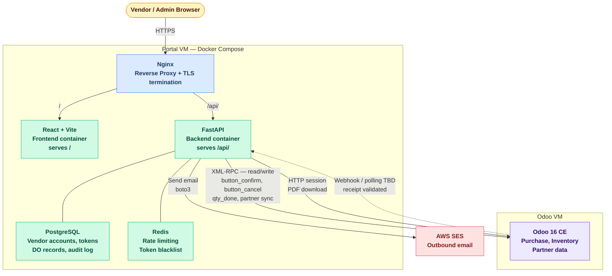

# Vendor Portal - Specification Document
> Specs & Approach Document — no implementation code

| Tài liệu | Mục đích |
|---|---|
| **README.md** (file này) | Business logic, quy trình nghiệp vụ, và các quyết định thiết kế cấp cao |
| [PROCESS_FLOW.md](PROCESS_FLOW.md) | Sơ đồ luồng chi tiết: RFQ → PO → DO → Giao hàng → Xác nhận, kèm swimlane và state machine |
| [roadmap.md](roadmap.md) | Kế hoạch triển khai theo phase: DB schema, API endpoints, cấu hình hạ tầng, checklist go-live |

---

## Project Summary

An independent bilingual (Vietnamese + English) web portal serving two types of users: **vendors** and **portal admins**. Vendors log in using their **Vendor ID** (`res.partner.id` from Odoo), confirm or reject Sent RFQs, edit Delivery Orders (quantities and delivery date), digitally sign and print DOs, and track delivery status through to store receipt confirmation. The portal also supports returns via Return Purchase Orders (RPO) and Goods Return Notes. Vendors can export data as PDF or CSV for invoicing and reconciliation. Portal admins share the same interface but have additional access to view all vendors, all POs and DOs across the system, trigger the Odoo sync manually, unlock signed DOs, and download any vendor's signed PDF. The portal runs on a separate VM from Odoo and integrates via Odoo's XML-RPC API using a dedicated service account. **Vendors only access the portal; stores only access Odoo.** All email is delivered via AWS SES.

---

## Confirmed Decisions

| Concern | Decision |
|---|---|
| Odoo version | 16 Community Edition |
| Odoo API protocol | XML-RPC (Python `xmlrpc.client`) |
| Vendor login identifier | `res.partner.id` (integer, assigned by Odoo — never changes) |
| Vendor password | Portal-owned, stored in portal PostgreSQL only |
| Profile data source | One-way sync from Odoo `res.partner` for profile fields (name, company, phone, tax ID). Email is copied from Odoo on initial account creation only (used to send the welcome email), then never overwritten by sync |
| Account provisioning | Auto from Odoo partners where `supplier_rank > 0` |
| Portal language | Vietnamese + English (bilingual, user-switchable) |
| HTTP client (frontend) | Native `fetch` API — no axios or third-party HTTP lib |
| Portal PO statuses | Waiting (`sent`), Confirmed (`purchase`), Cancelled (`cancel`) — Draft (`draft`) is not shown. Auto-cancel after 7 days past Expected Arrival if vendor has not confirmed or rejected |
| Portal DO statuses | Draft, Signed, Done, Cancelled |
| Odoo PO states (unchanged) | RFQ / RFQ Sent / Purchase Order / Cancelled — portal does not modify Odoo's base behaviour |
| DO per PO | Exactly 1 DO auto-created per confirmed PO — vendor cannot create additional DOs |
| DO delivery date | Single date for the entire DO (not per product line) |
| DO editing | Vendor edits delivery date + quantities (qty <= ordered qty from PO) |
| DO locking trigger | Vendor digital signature only — no 23:00 cutoff |
| DO signing | Digital signature on portal locks the DO, pushes delivery date + set quantities to Odoo Receipt |
| DO printing | After signing, vendor can print DO PDF (includes signature) multiple times |
| DO PDF language | Vietnamese only — all printed DO PDFs use Vietnamese labels |
| DO PDF content | PO number encoded as Code128 barcode (scannable by handheld), vendor info (Vendor ID, Tax ID, mobile, email), store ID (from `stock.warehouse.code`), PO confirmation date, delivery date, product table with single UoM column |
| UoM handling | Single UoM per product line, inherited from PO (e.g., Thùng 12 Chai, Kg). Vendor can only adjust quantity, not UoM. If UoM is wrong, PO must be re-created |
| Receipt confirmation | Store confirms Receipt in Odoo — sets final qty_done. DO status becomes Done, showing final received amounts |
| Returns | RPO (Return Purchase Order) + RN (Return Note / Biên Bản Trả Hàng). Vendor can only set pickup date and confirm — cannot change quantities. Must sign and print RN like DO |
| PO auto-cancel | If vendor does not confirm or reject within 7 days past Expected Arrival date, PO is auto-cancelled |
| Vendor PO confirmation | Vendor confirms Sent RFQ via portal → portal calls `button_confirm` on `purchase.order` in Odoo (no email notification) |
| Vendor RFQ rejection | Vendor rejects Sent RFQ via portal → portal calls `button_cancel` on `purchase.order` in Odoo + email to PO creator |
| Post-signature locking | DO locked after vendor signs — portal admin (buyer) can unlock directly in the portal (vendor notified by email, no reason required) |
| Data retention | 24 months — POs older than 24 months are permanently deleted from portal DB. Applies to all statuses |
| Data export | Vendors can export as PDF (individual or summary) or CSV. Single or bulk export. Date range filter available |
| Backorder handling | Vendor submits qty only — store validates and decides in Odoo |
| Admin role | Separate `admin_users` table, password set via env variable initially |
| Admin capabilities | View all vendors, trigger sync, view all POs/DOs, unlock signed DOs, download any PDF |
| Admin UI | Same layout as vendor portal with additional admin menu items |
| Signature capture | `signature_pad.js` → PNG sent to backend |
| PO list search | Filter by PO number and date range |
| Vendor dashboard summary | PO counts by status (Waiting, Confirmed, Cancelled) shown above PO list |
| Vendor comment on DO | Free-text note added when vendor signs the DO |
| PDF retention | 24 months — matching PO data retention |
| Responsive design | Works on both desktop and mobile equally |
| Vendor accounts | 1 Odoo partner = 1 portal account. Login by Vendor ID (`res.partner.id`). No multi-user per vendor |
| Profile changes | All profile changes must go through Odoo — admin cannot edit in portal |
| Admin language | Bilingual (Vietnamese + English) — same as vendor portal |
| SSL / TLS | Handled at infrastructure level (load balancer / reverse proxy) |
| Audit logging | Key actions logged in DB: login, po_confirm, po_reject, do_update, do_sign, do_unlock, receipt_validated |
| Email notifications | Invite, password reset, PO rejection (to PO creator), receipt confirmed (to vendor with discrepancy alert if any), DO unlocked (to vendor) |
| Store email recipient | Email sent to the person who created the PO in Odoo (not a generic inbox) |
| Email service | AWS SES |
| Frontend stack | React + Vite |
| Backend stack | FastAPI (Python) |
| Database | PostgreSQL (portal-owned) |
| Cache / rate limiting | Redis |
| Deployment | Docker Compose on a separate VM, Nginx reverse proxy |

---

## Architecture Overview



**Key principle:** The React frontend never contacts Odoo. All Odoo communication is proxied through the FastAPI backend using a single service account. Vendor credentials never leave the portal's own database.

---

## Data Flow Summary

### Authentication flow
1. Vendor enters their **Vendor ID** (integer — `res.partner.id` from Odoo) and password on the login page
2. Backend looks up `vendor_users` by `odoo_partner_id`
3. Password verified with bcrypt — same error message for all failure cases
4. On success, issues a JWT access token (30 min) and refresh token (7 days)
5. All subsequent requests carry the access token in the `Authorization` header
6. Expired access tokens are silently refreshed using the refresh token
7. On refresh failure, vendor is redirected to the login page

### Profile sync flow
1. Scheduled job runs every 6 hours, reads `res.partner` where `supplier_rank > 0`
2. **New partner:** creates `vendor_users` row (no password, inactive) linked by `odoo_partner_id`. Generates 24h invite token, sends welcome email via AWS SES containing the **Vendor ID** and set-password link
3. **Existing partner:** syncs profile fields only (`full_name`, `company_name`, `phone`, `tax_id`) — `hashed_password` is **never overwritten** by sync
4. **Partner deactivated in Odoo:** sets `is_active = FALSE` — vendor can no longer log in
5. Partners with no email in Odoo are skipped and logged for manual follow-up (email is needed to deliver the welcome email)

### Delivery Order (DO) flow
1. When a vendor confirms a PO, the portal auto-creates exactly 1 DO linked to the PO
2. Vendor edits the DO: sets delivery date and quantities per product line (qty must be <= ordered qty from PO)
3. Saves are incremental — vendor can save and come back multiple times while the DO is in Draft state
4. When ready, vendor clicks "Sign DO", draws their digital signature, and confirms
5. Backend verifies ownership, stores the signature PNG, generates the signed DO PDF (WeasyPrint + pypdf), and marks the DO as **locked** in the portal database
6. Backend pushes delivery date + set quantities to the corresponding Odoo Receipt via XML-RPC (these become pre-filled quantities in the Receipt, not yet `qty_done`)
7. Vendor can print the signed DO PDF multiple times — this is the document they bring to the store
8. The DO is now read-only in the portal — only a portal admin can unlock it (vendor is notified by email on unlock)

### Receipt confirmation flow (store-side, reflected on portal)
1. Vendor delivers goods to the store with the printed DO (2 paper copies, both parties sign, each keeps 1)
2. Store reviews the Receipt in Odoo — can adjust the pre-filled set quantities before confirming
3. Store confirms the Receipt in Odoo — `qty_done` is finalized
4. Portal receives notification that the Receipt is validated (sync mechanism TBD — webhook vs polling, pending team confirmation)
5. DO status on portal becomes **Done** — the final received amounts are shown on the DO
6. Portal sends an email to the vendor confirming receipt, alerting if any quantities differ between DO and receipt
7. Vendor can see both their DO quantities and the store's final received quantities on the DO detail page
8. Vendor can export the data as PDF or CSV for invoicing and reconciliation

### Sync mechanism (Odoo → Portal)
- **TBD — pending team confirmation.** Options under consideration:
  - (a) Webhook: Odoo sends notification to portal on receipt validation (requires lightweight Odoo module)
  - (b) Polling: portal periodically checks Odoo for state changes
  - (c) Nightly batch sync at 23:00
- Portal → Odoo communication (PO confirm/reject, DO push) is always real-time via XML-RPC

---

## Business Logic and Flow

This section describes the portal's behaviour in plain business terms, intended for stakeholder communication. It covers the four main scenarios: onboarding a new vendor, day-to-day portal usage, the delivery confirmation workflow, and exception handling.

---

### 1. Vendor Onboarding

**Trigger:** A new vendor is registered in Odoo with `supplier_rank > 0` and has a valid email address on their partner record.

**What happens automatically:**
1. The portal sync job runs every 6 hours and detects the new vendor in Odoo
2. A portal account is created, linked to the vendor's Odoo ID
3. The vendor receives a **Welcome Email** (in Vietnamese by default) containing:
   - Their **Vendor ID** (`res.partner.id`) — the integer they will use to log in
   - A **set-password link** valid for 24 hours
4. The vendor clicks the link, sets their own password, and their account becomes active
5. From this point, the vendor can log in at any time using their Vendor ID and password

**If the vendor misses the 24h window:** they use the "Forgot Password" option on the login page, enter their Vendor ID, and receive a new reset link.

**If the vendor has no email in Odoo:** the sync job skips them and logs the case. The internal team must add an email to the Odoo partner record — the account will be created on the next sync cycle.

**Profile updates:** If the vendor's name, phone, tax ID, or company name changes in Odoo, the portal reflects those changes automatically on the next sync. The vendor's **password** is managed on the portal only and is never overwritten by sync. The Vendor ID never changes — it is the permanent `res.partner.id` assigned by Odoo.

---

### 2. Viewing Purchase Orders

**Who can see what:** Each vendor sees only their own Purchase Orders. It is technically impossible for a vendor to view another vendor's data.

**Which POs are visible (portal statuses):**
- **Waiting** — RFQ has been sent to the vendor and is awaiting confirmation. Vendor can confirm or reject it.
- **Confirmed** — PO has been approved, DO has been created. Vendor can edit and sign the DO.
- **Cancelled** — PO has been cancelled (vendor rejected, or store cancelled). Read-only.

Draft RFQs are not shown. Vendors can view PO data for **24 months** from creation date. Older POs are permanently deleted.

**Confirming a Sent RFQ:**
- A "Confirm PO" button is shown on Waiting PO detail pages
- Vendor clicks "Confirm PO" → portal calls `button_confirm` on `purchase.order` via XML-RPC using the service account
- Odoo updates the PO state from `sent` to `purchase` and generates the linked Delivery Order / Receipt
- The portal reflects the new `purchase` state immediately after the call succeeds
- Once confirmed, the button is no longer shown — the record is now read-only on the PO level

**Searching and filtering:**
- Vendor can search by PO number (e.g. typing "PO004" filters the list instantly)
- Vendor can filter by date range (e.g. "POs from January to March")
- Results are paginated — 20 POs per page

**PO detail view:** clicking a PO shows the full list of ordered products with quantities and expected delivery dates, plus the linked DO with its status (Draft / Signed / Done / Cancelled).

---

### 3. Delivery Order & Delivery Workflow

This is the core business process of the portal. It covers the full flow from DO creation to physical delivery at the store.

```
Purchase Order confirmed in Odoo
         │
         ▼
1 DO auto-created per confirmed PO (ref number follows PO)
         │
         ▼
Vendor logs into portal, edits DO:
  - Single delivery date for the entire DO
  - Quantities per product line (≤ ordered qty, base UoM only)
  (can save and come back multiple times — DO remains in Draft)
         │
         ▼
Vendor clicks "Sign DO" — draws digital signature + optional comment
         │
         ▼
Portal generates signed DO PDF (Vietnamese, PO as Code128 barcode)
DO is locked — no further edits on Portal
         │
         ▼
Vendor downloads and prints PDF (2 copies)
         │
         ▼
Vendor brings 2 DO copies + goods to the store (cửa hàng)
         │
         ▼
Store receives goods, checks quantities
Both parties sign physically on 2 paper copies — each keeps 1
         │
         ▼
Store confirms on Odoo
         │
         ▼
Store reviews Receipt in Odoo, finalizes qty_done
         │
         ▼
DO status becomes Done on portal
Vendor receives email (alerts if any qty differs)
```

**Key points for stakeholders:**
- Vendor ký xác nhận DO trên Portal trước khi giao hàng — PDF có chữ ký là chứng từ chính thức
- Vendor cầm 2 bản DO (PDF đã ký) ra cửa hàng — cửa hàng ký physically cả 2 bản
- Cửa hàng xác nhận trên Odoo sau khi nhận hàng và ký DO
- Không có quy trình tự động khoá DO — vendor chủ động ký khi sẵn sàng giao
- No email is sent when vendor signs — the signed PDF is the vendor's own document to bring to the store

---

### 4. PO and DO Status Lifecycle

**PO Statuses (portal-managed):**

| Portal PO Status | Odoo PO State | Trigger | Vendor can do |
|---|---|---|---|
| **Waiting** | `sent` | Store sends RFQ | Confirm or Reject |
| **Confirmed** | `purchase` | Vendor confirms PO | View DO, export data |
| **Cancelled** | `cancel` | Vendor rejects or store cancels | Read-only |

**DO Statuses (portal-managed):**

| DO Status | Trigger | Vendor can do |
|---|---|---|
| **Draft** | PO confirmed, DO auto-created | Edit delivery date + quantities, save multiple times |
| **Signed** | Vendor signs DO digitally | Read-only, print DO PDF (multiple times). Data pushed to Odoo Receipt |
| **Done** | Store confirms Receipt in Odoo | Read-only, view final received amounts alongside delivery amounts, export PDF/CSV |
| **Cancelled** | PO cancelled (before receipt confirmation) | Read-only |

**Cancellation rules:**
- A PO can only be cancelled if the linked Receipt has **not** been confirmed by the store (no `qty_done`)
- If the Receipt has already been confirmed in Odoo, cancellation is blocked — the portal shows a warning and the vendor must contact procurement to resolve

---

### 5. Post-Signature Locking and Unlocking

**Why DOs are locked after signing:** Once a vendor confirms delivery quantities with their digital signature, the DO becomes the official delivery document. The signed PDF is what the vendor prints and brings to the store. Allowing edits after signing would undermine the document's integrity.

**What "locked" means in practice:**
- All quantity and date fields on the DO are read-only in the portal
- The signed DO PDF remains downloadable and printable at any time
- The vendor cannot re-sign or submit a new signature
- The delivery date and set quantities have already been pushed to Odoo's Receipt

**Unlocking process:**
If quantities were entered incorrectly and the vendor needs to resubmit, a portal admin can unlock the DO directly from the admin section (`/admin/vendors/:id`). Unlocking:
1. Removes the portal lock record
2. Sends an email notification to the vendor informing them the DO has been unlocked
3. The vendor can then update quantities/date and re-sign
4. The unlock action is logged in `delivery_orders` (unlocked_at, unlocked_by) and `audit_log`

---

### 6. Email Notifications Summary

| Event | Recipient | Language | Content |
|---|---|---|---|
| New vendor account created | Vendor | Vietnamese (default) | Vendor ID (integer) + set-password link |
| Password reset requested | Vendor | Vendor's preferred language | Reset link (24h expiry) |
| Vendor rejects RFQ | PO creator (store staff) | Vietnamese | PO rejected + cancelled in Odoo |
| PO auto-cancelled (7 days) | Vendor + PO creator | Vendor's pref lang / Vietnamese | PO auto-cancelled due to no response within 7 days past Expected Arrival |
| Store confirms receipt | Vendor | Vendor's preferred language | Receipt confirmed notification. Alerts if any quantities differ between DO and receipt |
| RPO created by store | Vendor | Sent by Odoo (Send by Email) | Return order notification — vendor should log into portal to confirm |
| DO unlocked by admin | Vendor | Vendor's preferred language | Notification that DO has been unlocked for re-editing |

**Note:** No email is sent when a vendor confirms a PO (the confirmation is pushed to Odoo in real-time) or when a vendor signs a DO/RN (the data is pushed to Odoo automatically). The store email recipient is always the specific person who created the PO in Odoo, not a generic team inbox. RPO email is sent by Odoo natively (not by the portal).

---

### 7. What the Portal Does NOT Do

It is equally important for stakeholders to understand the boundaries of the portal:

- **Does not validate stock movements** — all Odoo validation is done by the store in Odoo
- **Does not create Purchase Orders** — vendors can confirm or reject a Sent RFQ but cannot create POs or edit PO lines
- **Does not handle invoicing or payments** — outside the scope of this portal (vendors can export data for their own invoicing)
- **Does not manage backorders** — the store decides on backorders in Odoo after reviewing quantities
- **Does not modify Odoo's base behaviour** — Odoo states and workflows remain unchanged
- **Does not expose any Odoo credentials to vendors** — vendors have no access to Odoo, directly or indirectly
- **Does not allow vendors to see other vendors' data** — enforced at every layer of the system

---

### 8. Data Sync between Portal and Odoo (⚠️ Pending IT Confirmation)

> **Lưu ý:** Section này tập hợp tất cả các điểm liên quan đến việc đồng bộ dữ liệu giữa Portal và Odoo. Cần hỏi lại IT team để xác nhận cơ chế và thời điểm sync trước khi implement.

**Các điểm cần xác nhận với IT:**

| # | Chủ đề | Mô tả hiện tại | Cần xác nhận |
|---|---|---|---|
| 1 | **Order Deadline / auto-cancel** | Specs giả định PO có Expected Arrival date, auto-cancel sau 7 ngày nếu vendor không action | Odoo 16 CE có trường Expected Arrival trên `purchase.order` không? Trường nào? Cơ chế hết hạn RFQ hoạt động ra sao? |
| 2 | **Vendor profile sync** | Sync job chạy mỗi 6h, đọc `res.partner` từ Odoo → tạo/cập nhật `vendor_users` trên Portal | Tần suất sync? Real-time hay batch? |
| 3 | **PO data sync** | Portal đọc PO trực tiếp từ Odoo qua XML-RPC mỗi khi vendor truy cập | Cache strategy? Có cần sync PO về Portal DB không? |
| 4 | **PO confirmation → Odoo** | Portal gọi `button_confirm` trên `purchase.order` qua XML-RPC | Có cần thêm validation nào phía Odoo không? |
| 5 | **PO rejection → Odoo** | Portal gọi `button_cancel` trên `purchase.order` qua XML-RPC | `button_cancel` có hoạt động trên Odoo 16 CE cho PO ở state `sent` không? |
| 6 | **DO data** | DO auto-created trên Portal khi PO confirmed. Ref number theo PO | Portal tự tạo DO hay Odoo tạo picking rồi Portal đọc? |
| 7 | **DO sign → Odoo** | Sau khi vendor ký DO, delivery date + set quantities push về Odoo Receipt | Push bằng XML-RPC write vào `stock.picking` / `stock.move.line`? Trường nào? |
| 8 | **Receipt validation (Odoo → Portal)** | Store confirms Receipt trên Odoo → Portal cần biết để cập nhật DO status = Done | Webhook, polling, hay nightly sync? Cần lightweight Odoo module không? |
| 9 | **Receipt PDF** | Portal fetch delivery slip PDF từ Odoo HTTP session | Có cần lưu PDF trên Odoo hay chỉ Portal? |
| 10 | **Vendor deactivation** | Khi vendor bị deactivate trên Odoo → sync job set `is_active = FALSE` trên Portal | Có cần deactivate ngay lập tức hay chờ sync cycle? |

**Cơ chế sync hiện tại (draft — chờ IT xác nhận):**
- **Odoo → Portal:** Scheduled job (mỗi 6h) cho vendor profiles; XML-RPC read-on-demand cho PO/Receipt
- **Portal → Odoo:** XML-RPC write cho PO confirm (`button_confirm`), reject (`button_cancel`), DO push (delivery date + quantities)
- **Odoo → Portal (receipt validation):** TBD — webhook vs polling vs nightly batch
- **PDF fetch:** HTTP session riêng (không dùng XML-RPC) để tải delivery slip từ Odoo

---

> For implementation phases, DB schema, API endpoints, and developer gotchas see [roadmap.md](roadmap.md).
