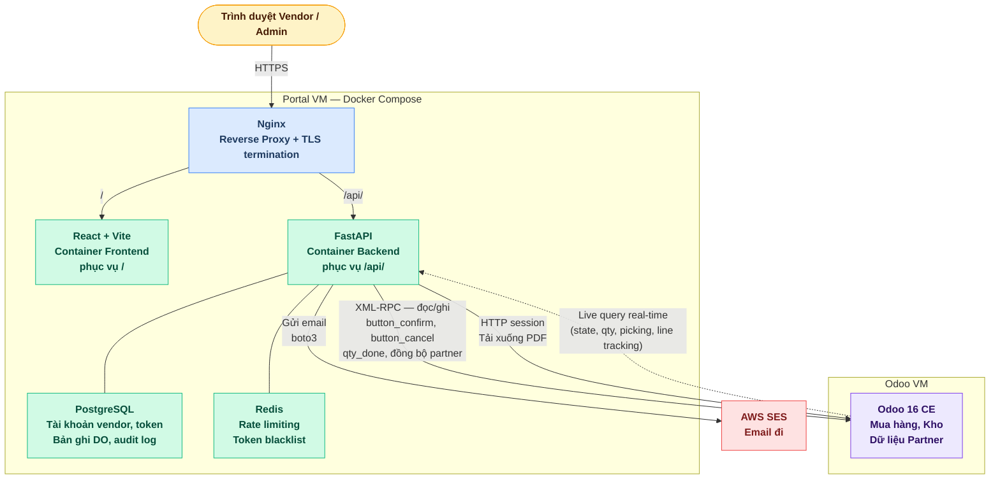
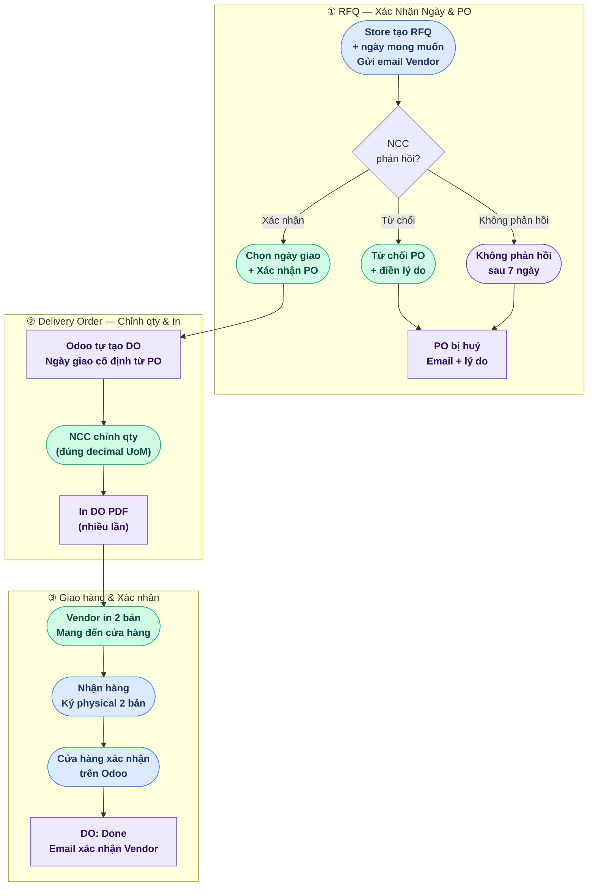

# Vendor Portal - Tài Liệu Đặc Tả
> Tài liệu Specs & Approach — không bao gồm code triển khai

| Tài liệu | Mục đích |
|---|---|
| **README.md** (file này) | Business logic, quy trình nghiệp vụ, và các quyết định thiết kế cấp cao |
| [PROCESS_FLOW.md](PROCESS_FLOW.md) | Sơ đồ luồng chi tiết: RFQ → PO → DO → Giao hàng → Xác nhận, kèm swimlane và state machine |
| [roadmap.md](roadmap.md) | Kế hoạch triển khai theo phase: DB schema, API endpoints, cấu hình hạ tầng, checklist go-live |

---

## Tổng Quan Dự Án

Một cổng thông tin web song ngữ (Tiếng Việt + Tiếng Anh) độc lập phục vụ hai loại người dùng: **nhà cung cấp (vendor)** và **quản trị viên portal (portal admin)**. Vendor đăng nhập bằng **Vendor ID** (`res.partner.id` từ Odoo), xác nhận hoặc từ chối các RFQ đã gửi, chỉnh sửa Delivery Order (số lượng, ghi chú) và in DO PDF, đồng thời theo dõi trạng thái giao hàng cho đến khi cửa hàng xác nhận biên nhận. Portal cũng hỗ trợ trả hàng thông qua Return Purchase Order (RPO) và Phiếu Nhận Hàng (Return Order). Vendor có thể xuất dữ liệu dưới dạng PDF hoặc CSV phục vụ lập hóa đơn và đối soát. Portal admin dùng chung giao diện với vendor nhưng có thêm quyền xem toàn bộ vendor, toàn bộ PO và DO trong hệ thống, kích hoạt đồng bộ Odoo thủ công, và tải xuống PDF của bất kỳ vendor nào (mở khoá DO thực hiện trực tiếp trên Odoo, không qua Portal). Portal chạy trên một VM riêng biệt với Odoo và tích hợp qua Odoo XML-RPC API bằng một tài khoản dịch vụ chuyên dụng. **Vendor chỉ truy cập portal; cửa hàng chỉ truy cập Odoo.** Toàn bộ email được gửi qua AWS SES.

---

## Các Quyết Định Đã Hoàn Thành

| Vấn đề | Quyết định |
|---|---|
| Phiên bản Odoo | 16 Community Edition |
| Giao thức Odoo API | XML-RPC (Python `xmlrpc.client`) |
| Định danh đăng nhập Vendor | `res.partner.id` (số nguyên, do Odoo cấp — không bao giờ thay đổi) |
| Mật khẩu Vendor | Thuộc portal, lưu trong portal PostgreSQL nội bộ |
| Nguồn dữ liệu hồ sơ | Đồng bộ một chiều từ Odoo `res.partner` cho các trường hồ sơ (tên, công ty, điện thoại, mã số thuế). Email được sao chép từ Odoo chỉ khi tạo tài khoản lần đầu (dùng để gửi email chào mừng), sau đó không bao giờ bị ghi đè bởi sync |
| Khởi tạo tài khoản | Tự động từ các partner Odoo có `is_vendor = True` **và** có `email` |
| Ngôn ngữ portal | Tiếng Việt + Tiếng Anh (song ngữ, người dùng tự chuyển đổi) |
| Trạng thái PO trên portal | Waiting (`sent`), Confirmed (`purchase`), Canceled (`cancel`) — Draft (`draft`) không hiển thị. Tự động huỷ sau 7 ngày kể từ Expected Arrival nếu vendor chưa xác nhận hoặc từ chối |
| Trạng thái DO trên portal | **4 trạng thái** song ngữ (VN / EN): **Mới (New)** — vendor sửa qty + ghi chú tổng phiếu; **Đã Gửi (Sent)** — sau 23:00 cutoff đêm trước ngày giao, UI lock không cho chỉnh; **Đã Hoàn Thành (Done)** — cửa hàng xác nhận Receipt; **Đã Huỷ (Canceled)** — khi PO bị huỷ trước khi nhận. **DO-LIVE-001: không lưu local DB, derive trực tiếp từ Odoo theo thời gian thực** |
| Trạng thái PO Odoo (không thay đổi) | RFQ / RFQ Sent / Purchase Order / Canceled — portal không thay đổi hành vi gốc của Odoo |
| DO trên mỗi PO | Odoo tự động tạo đúng 1 DO (stock.picking) khi PO được xác nhận — portal đọc và hiển thị. Vendor không thể tạo thêm DO |
| Xác nhận ngày giao PO | Trường "ngày dự kiến giao hàng" trên Portal **mặc định pre-fill bằng `date_planned` cửa hàng đã chọn** (không hiển thị placeholder dd/mm/yyyy trống). NCC có thể giữ nguyên hoặc chọn lại ngày khác trước khi xác nhận. Portal cập nhật `date_planned` trên `purchase.order`. Ngày vendor chọn không được quá 7 ngày sau `date_planned` của cửa hàng |
| Quy trình xác nhận PO | 1 bước: Vendor chọn ngày giao → nhấp **"Xác Nhận Đơn Đặt Hàng"** → portal cập nhật `date_planned` trên PO + gọi `button_confirm` cùng lúc → Odoo tạo DO với `scheduled_date` = `date_planned` |
| Từ chối PO | Khi NCC nhấp "Từ Chối", popup yêu cầu điền lý do. Sau khi xác nhận → push cancel về Odoo + log lý do |
| Ngày giao hàng DO | **Cố định** — lấy từ `scheduled_date` đã được cập nhật khi NCC xác nhận ngày giao trên PO. NCC không chỉnh ngày trên DO |
| Chỉnh sửa DO | Khi PO được xác nhận, **số lượng giao trên DO mặc định = số lượng đặt** (không phải 0). Vendor có thể chỉnh giảm nhưng **không được tăng vượt số lượng đặt** (hệ thống chặn cứng, không chỉ cảnh báo). Decimal theo UoM: **kg / lít / mét → 2 chữ số thập phân**; **các UoM còn lại (bao gồm gram, thùng, chai, cái, hộp, units) → 0 chữ số thập phân (số nguyên)**. Vendor cũng nhập ghi chú tổng phiếu giao hàng (header-level). Không chỉnh ngày, không có ghi chú riêng từng dòng SP. **Nếu sau đó cửa hàng sửa qty trên PO Odoo (ví dụ 10 → 12): portal KHÔNG đọc lại để refresh default — giữ nguyên giá trị vendor đã lưu** |
| Điều kiện khoá DO | 23:00 cutoff đêm trước ngày giao hàng — DO tự động chuyển sang **Đã Gửi (Sent)**. **Chỉ UI lock trên Portal** (derive từ `scheduled_date.date() <= today`), không tác động lên Odoo. Mục đích: chốt SL Giao của vendor để cửa hàng có thời gian nhập số lượng thực tế trên Odoo trong ngày giao |
| Ký DO | **Không cần ký điện tử** — vendor chỉ cần in PDF trực tiếp |
| In DO | PDF tạo on-the-fly mỗi lần in (phiên bản mới nhất). Không lưu PDF trên server |
| Hạn chót DO | Hiển thị giờ và ngày cụ thể mà DO bị khoá (ví dụ: 23:00 ngày 15/04/2026). Sau thời điểm này vendor không thể chỉnh sửa trên portal |
| Ngôn ngữ DO PDF | Chỉ tiếng Việt — toàn bộ DO PDF in ra đều dùng nhãn tiếng Việt |
| Nội dung DO PDF | PDF tiếng Việt — barcode PO, thông tin vendor, mã cửa hàng, ngày xác nhận PO, ngày giao hàng, bảng sản phẩm (barcode, tên, UoM, số lượng giao, cột trống để cửa hàng điền) |
| Xử lý UoM | Một UoM duy nhất cho mỗi dòng sản phẩm, kế thừa từ PO. Vendor chỉ điều chỉnh **giảm** số lượng theo **decimal precision của UoM**: **kg / lít / mét → 2 chữ số thập phân** (ví dụ 1.25 kg, 0.75 lít); **các UoM còn lại → 0 chữ số thập phân, chỉ số nguyên** (bao gồm gram, thùng, chai, cái, hộp, units…). Không thay đổi UoM. Nếu UoM sai, PO phải được tạo lại. **Lưu ý kỹ thuật:** Odoo đang config `decimal_precision` của Product UoM = 0.001 (3 chữ số), nhưng portal chủ động giới hạn input xuống 2 chữ số cho kg/lít/mét và 0 chữ số cho các UoM khác — đây là quy tắc UX phía portal |
| Xác nhận biên nhận | Cửa hàng xác nhận Receipt trong Odoo — qty_done finalized. **DO-LIVE-001:** DO status derive trực tiếp từ `stock.picking.state` (done → Done). Webhook `receipt-validated` ghi audit + gửi email vendor |
| Trả hàng | RPO = purchase.order với qty âm → tạo stock.picking loại Return (outgoing). Vendor **không cần xác nhận RPO**, chỉ chỉnh ngày nhận hàng và in RO PDF. **Số lượng giao mặc định = số lượng đặt** (không phải 0). **Hạn chót RO = ngày trả hàng dự kiến + 7 ngày dương lịch** (calendar days, thống nhất cùng cách tính với auto-cancel PO; không dùng cơ chế 23:00 cutoff như DO). Sau hạn chót, **Odoo tự xác nhận trả hàng** (scheduled action phía Odoo, không phải portal) → portal chỉ đọc picking `state = done` và reflect. Portal **không** proactively đẩy gì lên Odoo. **Thời điểm chạy scheduled action và logic cụ thể là dependency phía Odoo team — đang chờ xác nhận, TBD.** Note hiển thị: *"Nhà cung cấp vui lòng đến lấy hàng trước hạn chót (dd/mm/yyyy)"* (chỉ ngày, không có giờ) |
| Tự động huỷ PO | Nếu vendor không xác nhận hoặc từ chối trong vòng **7 ngày dương lịch** (calendar days, không trừ T7/CN/lễ) kể từ Expected Arrival date, PO tự động bị huỷ |
| Vendor xác nhận PO | 1 bước: Vendor chọn ngày giao → nhấp "Xác Nhận Đơn Đặt Hàng" → portal cập nhật `date_planned` + gọi `button_confirm` cùng lúc → Odoo tạo DO với `scheduled_date` = `date_planned` (không gửi email) |
| Vendor từ chối RFQ | NCC nhấp "Từ Chối" → popup điền lý do → xác nhận → portal push cancel về Odoo + log lý do + **email gửi Buyer (`purchase.order.user_id`) + Kho Nhận Hàng (`purchase.order.picking_type_id.warehouse_id` → email warehouse / partner liên kết)** kèm lý do |
| 23:00 Cutoff DO | 23:00 đêm trước `scheduled_date` → DO chuyển sang **Đã Gửi (Sent)**. **Chỉ UI lock trên Portal** — derive từ `scheduled_date.date() <= today`. **KHÔNG có job push** — `qty_done` đã được vendor ghi real-time qua PATCH lên `stock.move.line.qty_done` suốt state Mới. **KHÔNG có nightly sync** — Done state cũng derive real-time từ `stock.picking.state`. Admin mở khoá bằng cách reset `scheduled_date` trên Odoo (không có endpoint unlock trên Portal) |
| Lưu trữ dữ liệu | 24 tháng — PO cũ hơn 24 tháng bị xóa vĩnh viễn khỏi portal DB. Áp dụng cho mọi trạng thái |
| Xuất dữ liệu | Vendor có thể xuất dưới dạng PDF (riêng lẻ hoặc tổng hợp) hoặc CSV. Xuất đơn lẻ hoặc hàng loạt. Có bộ lọc theo khoảng ngày |
| Xử lý backorder | Vendor chỉ nộp qty — cửa hàng xác nhận và quyết định trong Odoo |
| Vai trò Admin | Tài khoản admin riêng biệt, mật khẩu do portal quản lý |
| Quyền Admin | Xem toàn bộ vendor, kích hoạt sync, xem toàn bộ PO/DO, tải xuống bất kỳ PDF nào. **Không có chức năng mở khoá DO trên Portal** — admin reset `scheduled_date` trực tiếp trên Odoo để mở khoá |
| Giao diện Admin | Cùng bố cục với vendor portal, có thêm các mục menu dành cho admin |
| Tìm kiếm danh sách PO | Lọc theo số PO và khoảng ngày |
| Tóm tắt dashboard Vendor | Số lượng PO theo trạng thái (Waiting, Confirmed, Canceled) hiển thị phía trên danh sách PO |
| Ghi chú của Vendor trên DO | Ghi chú tổng ở cấp phiếu giao hàng (header) — một ô text cho toàn bộ DO. Không có ghi chú riêng từng dòng sản phẩm |
| Lưu trữ PDF | PDF không lưu trên server — tạo on-the-fly mỗi lần vendor in |
| Thiết kế responsive | Hoạt động tốt trên cả desktop và mobile |
| Tài khoản Vendor | 1 Odoo partner = 1 tài khoản portal. Đăng nhập bằng Vendor ID (`res.partner.id`). Không hỗ trợ nhiều người dùng trên cùng một vendor |
| Thay đổi hồ sơ | Mọi thay đổi hồ sơ phải thực hiện qua Odoo — admin không thể chỉnh sửa trong portal |
| Ngôn ngữ Admin | Song ngữ (Tiếng Việt + Tiếng Anh) — giống vendor portal |
| Audit logging | Các hành động người dùng quan trọng được ghi lại: đăng nhập, xác nhận/từ chối PO, cập nhật/in/mở khóa DO, xác nhận biên nhận |
| Thông báo email | Portal gửi: mời dùng, đặt lại mật khẩu, **hủy PO (gửi Buyer + Kho Nhận Hàng)**. **Email xác nhận biên nhận do Odoo gửi trực tiếp** (mỗi lần cửa hàng confirm/re-confirm picking) — đơn thuần, không cảnh báo chênh lệch. Vendor xem Log Note trên Portal nếu cần. **Không có email "DO mở khoá"** vì không có admin unlock |
| Người nhận email cửa hàng | Mọi sự kiện liên quan đến huỷ/từ chối PO gửi tới **(1) Buyer — `purchase.order.user_id`; fallback `create_uid` nếu `user_id` trống**, **VÀ (2) Kho Nhận Hàng — email lấy từ `purchase.order.picking_type_id.warehouse_id`** (cụ thể: ưu tiên field email trên `stock.warehouse`, hoặc partner liên kết với warehouse). Không bao giờ gửi đến hộp thư chung của cả nhóm |
| Dịch vụ email | AWS SES |

---

## Tổng Quan Kiến Trúc

**Nguyên tắc chính:** Frontend React không bao giờ liên lạc trực tiếp với Odoo. Toàn bộ giao tiếp với Odoo được proxy qua backend FastAPI sử dụng một tài khoản dịch vụ duy nhất. Thông tin xác thực của vendor không bao giờ rời khỏi cơ sở dữ liệu nội bộ của portal.

---

> Chi tiết implementation flows (Auth, Sync, DO, Receipt) xem tại [Data Flow Summary](roadmap.md#data-flow-summary) trong roadmap.md.

---

## Nghiệp Vụ và Luồng Xử Lý

Phần này mô tả hành vi của portal theo ngôn ngữ nghiệp vụ, dành cho giao tiếp với các bên liên quan. Bao gồm bốn kịch bản chính: onboarding vendor mới, sử dụng portal hằng ngày, quy trình xác nhận giao hàng, và xử lý ngoại lệ.

---

### 1. Onboarding Vendor

**Điều kiện kích hoạt:** Một vendor mới được đăng ký trong Odoo với `is_vendor = True` **và** có địa chỉ email hợp lệ trên bản ghi partner.

**Những gì xảy ra tự động:**
1. Job đồng bộ portal chạy mỗi 6 giờ và phát hiện vendor mới trong Odoo
2. Một tài khoản portal được tạo, liên kết với Odoo ID của vendor.
3. Quản trị viên cần Kích Hoạt Tài khoản của nhà cung cấp từ portal. 
4. Nhà Cung cấp nhận được **Email Chào Mừng** (mặc định bằng tiếng Việt) bao gồm:
   - **Vendor ID** (`res.partner.id`) — số nguyên dùng để đăng nhập
   - Một **link đặt mật khẩu** có hiệu lực trong 24 giờ
5. Nhà cung cấp nhấp vào link, đặt mật khẩu của mình, và tài khoản trở nên hoạt động
6. Từ thời điểm này, vendor có thể đăng nhập bất kỳ lúc nào bằng ID và mật khẩu

**Nếu vendor bỏ lỡ cửa sổ 24h:** họ dùng tùy chọn "Quên mật khẩu" trên trang đăng nhập, nhập Vendor ID và nhận được link đặt lại mới.

**Nếu vendor không có email trong Odoo:** job đồng bộ bỏ qua họ và ghi log trường hợp này. Đội nhà phải thêm email vào partner Odoo — tài khoản sẽ được tạo vào chu kỳ đồng bộ tiếp theo.

**Cập nhật hồ sơ:** Nếu tên, số điện thoại, mã số thuế hoặc tên công ty của vendor thay đổi trong Odoo, portal phản ánh những thay đổi đó tự động vào lần đồng bộ tiếp theo. **Mật khẩu** của vendor chỉ được quản lý trên portal và không bao giờ bị ghi đè bởi sync. Vendor ID không bao giờ thay đổi — đây là `res.partner.id` cố định do Odoo cấp.

---

### 2. Xem Purchase Order

**Ai xem được gì:** Mỗi vendor chỉ thấy Purchase Order của chính mình. Về mặt kỹ thuật, vendor không thể xem dữ liệu của vendor khác.

**Những PO nào được hiển thị (trạng thái portal):**
- **Waiting/Chờ xác nhận** — RFQ đã được gửi cho vendor và đang chờ xác nhận. Vendor có thể xác nhận hoặc từ chối.
- **Confirmed/Đã xác nhận** — PO đã được duyệt, DO đã được tạo, Vendor có thể in PDF 
- **Canceled** — PO đã bị hủy (vendor từ chối, hoặc cửa hàng hủy). Chỉ đọc.

RFQ ở trạng thái Draft không được hiển thị. Vendor có thể xem dữ liệu PO trong **3 tháng** gần nhất.

**Xác nhận đơn đặt hàng:**
- Trang chi tiết PO ở trạng thái Waiting hiển thị ngày mong muốn giao hàng từ cửa hàng (`date_planned`)
- Trường "ngày dự kiến giao" **mặc định pre-fill bằng `date_planned` của cửa hàng** — NCC có thể giữ nguyên hoặc chọn lại (không quá 7 ngày sau `date_planned` của cửa hàng)
- NCC nhấp **"Xác Nhận Đơn Đặt Hàng"** → portal cập nhật `date_planned` trên `purchase.order` + gọi `button_confirm` cùng lúc → Odoo tạo DO tự động (`stock.picking`) với `scheduled_date` = `date_planned`
- Sau khi xác nhận, PO chỉ đọc, hiển thị link đến DO và cần phải liên hệ nhân viên mua hàng để được cập nhật PO sau khi xác nhận.

**Từ chối đơn đặt hàng:**
- Nút "Từ Chối" hiển thị cùng trang chi tiết PO ở trạng thái Waiting
- NCC nhấp "Từ Chối" → **popup yêu cầu điền lý do từ chối**
- NCC điền lý do và nhấp "Xác nhận" → portal push cancel về Odoo + **log lý do**
- Portal gửi email thông báo đến **Buyer** (`purchase.order.user_id`) kèm lý do từ chối
- Từ chối là cuối cùng — cửa hàng phải tạo RFQ mới nếu muốn đặt hàng lại. 

**Tự động hủy:**
- Nếu vendor không xác nhận hoặc từ chối PO ở trạng thái Waiting trong vòng **7 ngày dương lịch kể từ Expected Arrival date** (`date_planned` trên `purchase.order`), portal tự động hủy trong Odoo. 
- Một scheduled job kiểm tra hằng ngày các PO Waiting quá hạn
- Email thông báo gửi đến **cả vendor lẫn Buyer** (`purchase.order.user_id`) khi PO bị tự động hủy

**Tìm kiếm và lọc:**
- Vendor có thể tìm kiếm theo số PO (ví dụ: gõ "PO004" để lọc danh sách tức thì)
- Vendor có thể lọc theo khoảng ngày (ví dụ: "PO từ tháng Một đến tháng Ba")
- Kết quả được phân trang — 20 PO mỗi trang

**Xem chi tiết PO:** nhấp vào PO hiển thị toàn bộ danh sách sản phẩm đặt hàng với số lượng và ngày giao hàng dự kiến, cùng với DO liên kết và trạng thái của nó: **Mới (New) / Đã Gửi (Sent) / Đã Hoàn Thành (Done) / Đã Huỷ (Canceled)**.

---

### 3. Delivery Order & Quy Trình Giao Hàng

Đây là quy trình nghiệp vụ cốt lõi của portal — từ RFQ đến giao hàng thực tế và xác nhận biên nhận.

> 🟢 Xanh lá = Vendor | 🔵 Xanh dương = Store | 🟣 Tím = Portal/System

#### 3.1 RFQ & PO Confirmation

- Store tạo RFQ trên Odoo với ngày mong muốn giao hàng (`date_planned`) — email tự động gửi cho Vendor
- Trên portal, trường ngày giao dự kiến **mặc định hiển thị `date_planned` của cửa hàng** — Vendor có thể giữ nguyên hoặc chọn lại ngày khác (không quá 7 ngày sau `date_planned` của cửa hàng) → nhấp **"Xác Nhận Đơn Đặt Hàng"** → portal cập nhật `date_planned` + gọi `button_confirm` cùng lúc → DO tự động tạo
- Nếu Vendor từ chối: popup lý do → PO bị huỷ trong Odoo + log lý do, email thông báo gửi **Buyer** (`purchase.order.user_id`) kèm lý do
- Nếu không phản hồi sau **7 ngày dương lịch** kể từ `date_planned`: hệ thống tự động huỷ PO, email gửi cả Vendor lẫn **Buyer**

#### 3.2 Delivery Order — Chỉnh qty & In

- Khi PO confirmed, **Odoo tự động tạo 1 DO** (stock.picking) — portal đọc qua XML-RPC
- `scheduled_date` trên DO = `date_planned` đã xác nhận — Odoo tự gán khi tạo DO, **ngày giao cố định, không chỉnh được trên DO**
- Portal đọc DO từ Odoo qua XML-RPC, **số lượng giao mặc định = số lượng đặt** (pre-fill đầy đủ, không phải 0), trạng thái **Draft**
- **Lưu ý về đồng bộ qty:** sau khi vendor đã lưu qty trên portal, nếu cửa hàng chỉnh `product_qty` trên PO Odoo (ví dụ tăng 10 → 12), portal **không** đọc lại để ghi đè giá trị đã lưu của vendor — vendor vẫn giữ nguyên qty họ đã nhập cho đến khi chính họ chỉnh sửa lại
- Vendor chỉnh sửa: **số lượng giao** từng dòng — chỉ được **chỉnh giảm**, **không được tăng vượt qty đặt** (hệ thống chặn cứng). Decimal theo UoM: **kg / lít / mét → 2 chữ số thập phân**, **các UoM khác (bao gồm gram, thùng, chai, cái, hộp, units) → 0 chữ số thập phân (số nguyên)**. Và **ghi chú tổng phiếu** (một ô text header, không có ghi chú riêng từng dòng SP)
- DO hiển thị **hạn chót** dưới dạng giờ + ngày cụ thể (ví dụ: 23:00 ngày 15/04/2026) — là thời điểm DO bị khoá, vendor không thể chỉnh sửa sau đó
- **Không cần ký điện tử** — vendor in DO PDF trực tiếp từ giao diện
- Vendor có thể **lưu nhiều lần, in nhiều phiên bản** — tất cả khi DO vẫn ở Draft
- PDF không lưu trên server — mỗi lần in luôn tạo phiên bản mới nhất

#### 3.3 23:00 Cutoff — Khoá DO (UI lock only, không push)

- Lúc **23:00 đêm trước ngày giao dự kiến**: DO chuyển sang **Đã Gửi (Sent)** trên giao diện web — UI lock thuần tuý. Vendor không thể chỉnh sửa sau thời điểm này, nhưng vẫn có thể in PDF.
- Dữ liệu SL Giao đã được Portal ghi real-time qua PATCH lên `stock.move.line.qty_done` trước đó. **Không có job push tại 23:00.**
- Ngày giao cố định từ PO — NCC đã chọn khi xác nhận PO và không thể đổi trên DO.

#### 3.4 Giao hàng thực tế

- Vendor in 2 bản PDF DO (phiên bản cuối cùng sau khi DO chuyển sang Đã Gửi)
- (ngoài hệ thống) Vendor mang hàng + 2 bản DO đến cửa hàng
- (ngoài hệ thống) Cả hai bên ký tay 2 bản paper — mỗi bên giữ 1 bản làm chứng từ

#### 3.5 Receipt Confirmation — Xác nhận nhận hàng

- Cửa hàng xem Receipt trong Odoo — `qty_done` đã được Portal ghi real-time từ trước (suốt state Mới của vendor)
- Cửa hàng có thể chỉnh `qty_done` thực tế nếu hàng hư hỏng → confirm Receipt → `stock.picking.state = done`
- Portal **live query** Odoo → DO chuyển sang Đã Hoàn Thành (Done) ngay lần render kế tiếp; cột "SL Giao" đổi label thành "SL Thực Nhận"
- **Email xác nhận biên nhận do Odoo gửi trực tiếp** (Portal không xử lý) — đơn thuần, không kèm cảnh báo chênh lệch. **Re-open scenario:** mỗi lần cửa hàng re-confirm picking trên Odoo, Odoo sẽ gửi lại email — Portal không can thiệp. Để xem lịch sử thay đổi `qty_done`, vendor xem **Log Note trên DO Form** (mục 8.5).

> Sơ đồ toàn bộ flow (bao gồm Returns) xem tại [PROCESS_FLOW.md](PROCESS_FLOW.md).

---

### 4. Vòng Đời Trạng Thái PO và DO

**Trạng thái PO (portal quản lý):**

| Trạng thái PO trên Portal | Trạng thái PO Odoo | Điều kiện kích hoạt | Vendor có thể làm |
|---|---|---|---|
| **Waiting** | `sent` | Cửa hàng gửi RFQ | Xác nhận hoặc Từ chối |
| **Confirmed** | `purchase` | Vendor xác nhận PO | Xem DO, xuất dữ liệu |
| **Canceled** | `cancel` | Vendor từ chối hoặc cửa hàng hủy | Chỉ đọc |

**Trạng thái DO (portal quản lý):**

| Label VN hiển thị | State kỹ thuật | Điều kiện kích hoạt | Vendor có thể làm |
|---|---|---|---|
| **Mới (New)** | Draft / `assigned` | PO confirmed, DO được tạo tự động (pre-fill SL Giao = SL Đặt) | Sửa qty + ghi chú tổng phiếu, lưu/in nhiều lần. SL Giao ghi real-time qua PATCH lên `stock.move.quantity_done` |
| **Đã Gửi (Sent)** | Locked (UI only) | 23:00 cutoff đêm trước ngày giao hàng → Portal UI lock, **không tác động lên Odoo** (dữ liệu đã ghi real-time từ trước) | Chỉ đọc, in PDF phiên bản cuối |
| **Đã Hoàn Thành** | Done | Cửa hàng đã confirm Receipt trong Odoo (real-time qua live query) | Chỉ đọc. Cột SL Giao đổi label thành **"SL Thực Nhận"** — hiển thị giá trị `qty_done` hiện tại (đã được cửa hàng chốt, có thể bị ghi đè so với vendor nhập nếu hàng hư hỏng). **Re-open trên Odoo:** nếu cửa hàng reopen picking để sửa `qty_done`, Portal live query tự cập nhật giá trị mới. Picking state có thể tạm về `assigned` rồi `done` lại; Portal phản ánh trung thực |
| **Đã Huỷ** | Cancelled | PO bị hủy (trước khi Receipt được xác nhận) | Chỉ đọc — hiển thị như một trạng thái đầy đủ, có filter riêng trên list view |

**Quy tắc hủy:**
- Một PO chỉ có thể bị hủy nếu Receipt liên kết **chưa** được cửa hàng xác nhận (không có `qty_done`)
- Nếu Receipt đã được xác nhận trong Odoo, việc hủy bị chặn — portal hiển thị cảnh báo và vendor phải liên hệ bộ phận mua hàng để giải quyết

---

### 5. Khoá và Mở Khoá DO

**23:00 Cutoff — tại sao khoá DO:**
Lúc 23:00 đêm trước ngày giao hàng (`scheduled_date`), DO trên Portal chuyển sang **Đã Gửi (Sent)** — UI lock không cho vendor chỉnh nữa. Mục đích:
1. Chốt SL Giao của vendor (đã được ghi real-time qua PATCH lên `stock.move.line.qty_done` suốt state Mới)
2. Cho cửa hàng có thời gian nhập số lượng thực tế trên Odoo (`stock.move.quantity_done`) trong ngày giao hàng — tránh vendor sửa qty sau khi cửa hàng đã bắt đầu kiểm hàng
3. Cửa hàng vẫn có thể điều chỉnh qty trên Purchase Order trên Odoo trước khi confirm (ví dụ: hàng hư hỏng)

**Cơ chế kỹ thuật:** Lock là **UI-only trên Portal**, derive thuần tuý từ `scheduled_date.date() <= today (UTC+7)`. Không có job, không có push tại 23:00, không có bảng portal_cutoff_locks. Xem [DO-LIVE-001](IssueLog.md) Blocker 1 cho chi tiết.

**Ý nghĩa thực tế của "Đã Gửi":**
- Tất cả các trường số lượng trên DO đều chỉ đọc trong portal
- Vendor vẫn có thể in PDF phiên bản cuối
- Vendor không thể chỉnh sửa sau hạn chót

**Trước khi Đã Gửi (Mới):** vendor tự do sửa/in nhiều lần; mỗi lần Lưu portal ghi qty xuống Odoo real-time.

**Quy trình mở khoá:** **Không có chức năng admin unlock trên Portal** (DO-LIVE-001 Blocker 6). Nếu cần mở khoá, admin **cập nhật `scheduled_date` trên Odoo trực tiếp** (đẩy về tương lai) → lock condition (`scheduled_date <= today`) tự động giải phóng → vendor có thể chỉnh lại trên Portal.

---

### 6. Tóm Tắt Thông Báo Email

| Sự kiện | Người nhận | Ngôn ngữ | Nội dung |
|---|---|---|---|
| Tài khoản vendor mới được tạo | Vendor | Tiếng Việt (mặc định) | Vendor ID (số nguyên) + link đặt mật khẩu |
| Yêu cầu đặt lại mật khẩu | Vendor | Ngôn ngữ ưa thích của vendor | Link đặt lại (hết hạn sau 24h) |
| Vendor từ chối RFQ | **Buyer** (`purchase.order.user_id`) | Tiếng Việt | PO bị từ chối + hủy trong Odoo |
| PO tự động hủy (7 ngày) | Vendor + **Buyer** | Ngôn ngữ ưa thích của vendor / Tiếng Việt | PO tự động hủy do không phản hồi trong 7 ngày kể từ Expected Arrival |
| Cửa hàng xác nhận biên nhận | Vendor | Tiếng Việt (Odoo native) | **Email do Odoo gửi trực tiếp** (không phải Portal) mỗi lần cửa hàng confirm picking — bao gồm re-confirm sau khi reopen. Đơn thuần, không cảnh báo chênh lệch. Vendor xem Log Note trên Portal nếu cần |
| RPO được cửa hàng tạo | Vendor | Gửi bởi Odoo (Send by Email) | Thông báo đơn trả hàng — vendor nên đăng nhập portal để xác nhận |

**Lưu ý:** Không gửi email khi vendor xác nhận PO (xác nhận được đẩy lên Odoo theo thời gian thực) hoặc khi vendor in DO/RO PDF. **Dữ liệu DO/RO được ghi lên Odoo real-time qua PATCH** mỗi khi vendor bấm Lưu — không có batch push tại 23:00. **Người nhận email từ cửa hàng luôn là Buyer — người mua phụ trách PO trong Odoo (`purchase.order.user_id`); nếu `user_id` trống, fallback về email của `create_uid`. Không bao giờ gửi đến hộp thư chung.** Email RPO được Odoo gửi nội bộ (không phải do portal gửi).

---

### 7. Những Gì Portal KHÔNG Làm

Điều quan trọng không kém là các bên liên quan cần hiểu rõ phạm vi của portal:

- **Không xác nhận biến động hàng tồn kho** — mọi xác nhận trong Odoo do cửa hàng thực hiện trong Odoo
- **Không tạo Purchase Order** — vendor có thể xác nhận hoặc từ chối Sent RFQ nhưng không thể tạo PO hoặc chỉnh sửa dòng PO
- **Không xử lý hóa đơn hay thanh toán** — nằm ngoài phạm vi của portal này (vendor có thể xuất dữ liệu cho mục đích lập hóa đơn của riêng mình)
- **Không quản lý backorder** — cửa hàng quyết định về backorder trong Odoo sau khi xem xét số lượng
- **Không thay đổi hành vi gốc của Odoo** — các trạng thái và quy trình của Odoo không bị thay đổi
- **Không để lộ thông tin xác thực Odoo cho vendor** — vendor không có quyền truy cập Odoo, dù trực tiếp hay gián tiếp
- **Không cho phép vendor xem dữ liệu của vendor khác** — được thực thi ở mọi tầng của hệ thống

---

### 8. Chi Tiết Giao Diện (UI Specifications)

#### 8.0 Cấu trúc Menu

Trước đây tất cả phiếu giao/nhận gộp chung dưới một menu "Phiếu Giao Nhận". Cấu trúc menu **mới tách thành 4 mục riêng biệt** để NCC dễ phân biệt quy trình mua vs quy trình trả:

| Menu | Bản chất kỹ thuật | Quy trình | Vai trò NCC |
|---|---|---|---|
| **Đơn Đặt Hàng** | `purchase.order` (RFQ + PO confirmed) | Mua hàng | Xác nhận / Từ chối |
| **Phiếu Giao Hàng (NCC giao)** | `stock.picking` type incoming (3SACH nhận từ NCC) — gắn với `purchase.order` thường | Mua hàng | Chỉnh SL giao, in PDF |
| **Đơn Trả Hàng** | `purchase.order` với qty âm (RPO) | Trả hàng | Xem, chỉnh ngày nhận |
| **Phiếu Nhận Hàng (3SACH nhận)** | `stock.picking` type outgoing trả hàng (RO) — gắn với RPO | Trả hàng | Chỉnh ngày nhận, in PDF |

Mỗi menu có list view + form view riêng. Spec chi tiết các section dưới (8.1, 8.2, 8.3, 8.4) áp dụng tương ứng.

#### 8.1 PO List View (Danh sách Đơn Đặt Hàng)

| Cột | Nguồn dữ liệu | Ghi chú |
|---|---|---|
| Số đơn hàng | `purchase.order.name` | |
| Ngày đặt hàng | `purchase.order.date_order` | |
| Ngày giao hàng (dự kiến) | `purchase.order.date_planned` | |
| **Warehouse (địa điểm giao)** | `stock.picking.picking_type_id` → `stock.warehouse.name` | **Mới** — tên địa điểm giao hàng |
| Trạng thái | Portal PO status (Waiting / Confirmed / Canceled) | Badge màu |
| **Phiếu Giao Hàng** | DO status derive từ `stock.picking.state` | **Đổi tên** — trước đây hiển thị "Trạng thái phiếu giao nhận", giờ đổi thành **"Phiếu Giao Hàng"** (khớp menu mới). Badge 4 state: **Mới / Đã Gửi / Đã Hoàn Thành / Đã Huỷ** |
| Tổng tiền | `purchase.order.amount_total` | |

**Tính năng trên PO List:**
- **Tick chọn** một hoặc nhiều phiếu PO → xuất ra file **PDF** hoặc **CSV**
- **Sort** theo tên (số PO)
- **Filter** theo: ngày giao hàng, trạng thái phiếu PO
- Phân trang: 20 PO/trang

#### 8.2 PO Form View (Chi tiết Đơn Đặt Hàng)

**Thông tin chung:**
- Bổ sung **Warehouse** (địa điểm giao hàng) hiển thị trên PO

**Bảng danh sách sản phẩm — các cột:**

| Cột | Nguồn dữ liệu | Ghi chú |
|---|---|---|
| Tên sản phẩm | `purchase.order.line.name` | Dùng field `name` trực tiếp (không phải `product_id.name`) |
| Mã NCC | `product.supplierinfo.product_code` | Mã sản phẩm của nhà cung cấp |
| **Mã Vạch** | `product.product.barcode` | **Đặt sau cột Mã NCC** (thứ tự cột: Tên SP → Mã NCC → Mã Vạch → Tên SP NCC) |
| Tên SP NCC | `product.supplierinfo.product_name` | Tên sản phẩm theo nhà cung cấp |
| Số lượng | `purchase.order.line.product_qty` | |
| Đơn giá | `purchase.order.line.price_unit` | |
| Discount | `purchase.order.line.discount` | Phần trăm chiết khấu |
| Thuế (VAT) | `purchase.order.line.taxes_id` | **Phải hiển thị data** (hiện implementation đang để trống). Hiển thị: VAT 5%, 8%, 10% giống giao diện Odoo |
| Thành tiền (-V) | `purchase.order.line.price_subtotal` | "Thành tiền (-V)" — chưa VAT |
| Tổng tiền (+V) | `purchase.order.line.price_total` | "Tổng tiền (+V)" — đã VAT |

> Cột **Thành tiền (-V)** và **Tổng tiền (+V)** nằm cuối cùng trong bảng.

**Khu vực tổng cuối phiếu PO (Summary):** Hiển thị tổng tóm tắt giống Odoo, **bắt buộc tách chi tiết theo từng mức VAT**:

| Dòng | Nguồn dữ liệu | Ghi chú |
|---|---|---|
| **Tổng Thành Tiền (-V)** | sum `purchase.order.line.price_subtotal` | Tổng chưa thuế |
| **Tổng Thuế** (tách dòng) | `purchase.order.amount_tax` chia theo từng `account.tax` | Mỗi mức thuế một dòng riêng: ví dụ "Thuế 5%: …", "Thuế 8%: …", "Thuế 10%: …" — không gộp thành một dòng "Tổng Thuế" duy nhất |
| **Tổng Tiền (+V)** | `purchase.order.amount_total` | Tổng đã thuế |

**Banner cảnh báo tự động huỷ (chỉ hiển thị khi PO ở trạng thái Waiting):**
> *"Đơn Đặt Hàng sẽ tự động huỷ sau Ngày Giao Dự Kiến + 7 nếu nhà cung cấp không phản hồi"*

(Banner cũ "Sẽ tự động huỷ sau Ngày Giao Dự Kiến nếu chưa phản hồi" **không chính xác** vì thực tế quy tắc là `date_planned + 7 ngày dương lịch`, không phải đúng ngày `date_planned`.)

**Nút hành động:**
1. Hiển thị ngày mong muốn giao hàng từ cửa hàng (`date_planned`). Trường ngày dự kiến giao **mặc định pre-fill bằng `date_planned` của cửa hàng** (hiển thị ngày cụ thể, ví dụ `23/05/2026`, không phải placeholder `dd/mm/yyyy`); NCC có thể giữ nguyên hoặc chọn lại (không quá 7 ngày sau `date_planned`). Nhấp **"Xác Nhận Đơn Đặt Hàng"** → hiển thị popup xác nhận với nội dung:
   > *"Bạn có chắc chắn muốn xác nhận Đơn Đặt Hàng `<PO_NAME>`?*
   > *Ngày đề nghị giao hàng: `<date_planned_ban_đầu_của_cửa_hàng>`.*
   > *Ngày bạn xác nhận giao hàng: `<ngày_NCC_chọn>`"*
   
   NCC bấm "Đồng ý" → portal cập nhật `date_planned` + gọi `button_confirm` cùng lúc.
2. Nhấp **"Từ Chối"** → popup điền lý do → xác nhận → cancel + log lý do
3. Sau khi xác nhận PO → hiển thị link đến phiếu giao hàng (DO)

#### 8.3 DO Form View (Phiếu Giao Hàng — NCC giao)

**Bảng danh sách sản phẩm — các cột:**

| Cột | Nguồn dữ liệu | Ghi chú |
|---|---|---|
| Tên sản phẩm | `purchase.order.line.name` | Giống PO — dùng field `name` |
| Mã NCC | `product.supplierinfo.product_code` | Giống PO |
| **Mã Vạch** | `product.product.barcode` | Đặt sau Mã NCC (thứ tự thống nhất với PO Form) |
| Tên SP NCC | `product.supplierinfo.product_name` | Giống PO |
| SL Đặt | `purchase.order.line.product_qty` | Qty từ PO (read-only). **Phải giữ nguyên giá trị này ngay cả sau khi cửa hàng confirm Receipt trên Odoo — không được reset về 0** (bug hiện tại: SL Đặt bị xoá về 0 sau confirm) |
| SL Giao | `stock.move.quantity_done` (computed sum của `stock.move.line.qty_done`) | NCC nhập trên Portal — Portal ghi xuống `qty_done` **real-time qua XML-RPC PATCH** mỗi khi vendor bấm Lưu. **Mặc định = SL Đặt** khi PO confirmed (autofill toàn bộ, NCC chỉ sửa dòng cần sửa). Editable trong state Mới, **freeze giá trị cuối** ở state Đã Gửi (UI lock). Chỉ chỉnh giảm, không tăng vượt SL đặt. Decimal theo UoM: **kg / lít / mét → 2 chữ số thập phân**, các UoM khác → số nguyên. **Label cột đổi theo state:** Mới/Đã Gửi → hiển thị "SL Giao"; Đã Hoàn Thành → hiển thị "SL Thực Nhận" (giá trị cửa hàng chốt khi validate — có thể bị ghi đè nếu hàng hư hỏng) |
| **Đơn giá** | `purchase.order.line.price_unit` | **Mới** — đồng bộ với PO |
| **CK (%)** | `purchase.order.line.discount` | **Mới** — phần trăm chiết khấu |
| **Thuế VAT** | `purchase.order.line.taxes_id` | **Mới** — hiển thị giống PO: VAT 5%, 8%, 10% |
| **Thành Tiền (-V)** | `price_unit × SL Giao × (1 − discount/100)` (discount là **phần trăm**) | **Mới** — recompute real-time theo giá trị `stock.move.quantity_done` hiện tại (1 field duy nhất xuyên suốt mọi state). Sau khi cửa hàng confirm, nếu họ sửa qty thì Thành Tiền cũng cập nhật theo giá trị mới |
| **Tổng Tiền (+V)** | Thành Tiền (-V) + thuế áp dụng | **Mới** — recompute real-time theo cùng cơ sở tính |

**Khu vực tổng cuối phiếu (Summary):** giống PO, **tính lại real-time** theo `stock.move.quantity_done` (1 field duy nhất — giá trị NCC nhập trong Mới, sau đó là giá trị cửa hàng chốt khi confirm):

| Dòng | Cách tính |
|---|---|
| **Tổng Thành Tiền (-V)** | sum cột Thành Tiền (-V) các dòng |
| **Tổng Thuế** (tách dòng) | mỗi mức thuế một dòng riêng: "Thuế 5%: …", "Thuế 8%: …", "Thuế 10%: …" |
| **Tổng Tiền (+V)** | sum cột Tổng Tiền (+V) các dòng |

> **Lưu ý về hoá đơn:** Portal **không** xử lý hoá đơn. Khi cửa hàng tạo invoice từ PO trên Odoo, Odoo tính giá trị theo `purchase.order.line.qty_invoiced`. **Công thức `qty_invoiced = qty_received − qty_returned` là customization của 3SACH**, không phải logic chuẩn Odoo 16 (standard Odoo: `qty_invoiced` = tổng qty đã được invoice từ vendor bill). Portal chỉ recompute để hiển thị cho NCC tham khảo theo SL giao/SL thực nhận.

**Indicator nút "Lưu" khi có thay đổi chưa lưu:**
- Trạng thái mặc định (không có thay đổi): nút **"Lưu"** hiển thị **trắng / xám nhạt** như hiện tại
- **Ngay khi NCC điều chỉnh bất kỳ giá trị nào** trong cột SL Giao (hoặc các trường editable khác) mà **chưa bấm Lưu** → nút "Lưu" chuyển sang **bold + nền đỏ** để nhấn mạnh cần bấm Lưu
- Sau khi NCC bấm "Lưu" thành công → nút quay về trắng / xám nhạt như cũ

**Ghi chú phiếu:** Portal DB — `delivery_orders.note` — một ô text ở **header DO**, vendor điền khi ở trạng thái Mới (Draft), áp dụng cho toàn bộ phiếu. Không có ghi chú riêng từng dòng SP.

> **Log Note:** xem mục **8.5 Log Note** ở dưới — áp dụng cho **cả 4 phiếu**: Đơn Đặt Hàng (PO), Phiếu Giao Hàng (DO), Đơn Trả Hàng (RPO), Phiếu Nhận Hàng (RO). Trên DO, Log Note đặc biệt hữu ích để vendor xem cửa hàng có sửa `qty_done` so với giá trị mình đã nhập hay không (do dùng 1 field duy nhất, không có cảnh báo chênh lệch qua email).

**Thay đổi quan trọng:**
- **Bỏ phần Ký phiếu giao nhận** — không cần chữ ký điện tử trên Portal
- **Chỉ cần In file PDF** — vendor nhấn nút In/Tải PDF trực tiếp
- **Ghi chú ở cấp phiếu (header)** — một ô text duy nhất cho toàn bộ DO, không có ghi chú riêng từng dòng SP

**Ngày giao hàng trên DO:**
- Ngày giao **cố định** = `scheduled_date` được Odoo gán tự động khi NCC xác nhận PO
- NCC **không chỉnh được** ngày giao trên DO — chỉ chỉnh qty

**Banner thông báo trạng thái khoá (2 phiên bản theo state):**

| State | Banner hiển thị | Ví dụ (`scheduled_date = 23/05/2026`) |
|---|---|---|
| **Mới** (trước cutoff) | *"Phiếu giao hàng sẽ bị khoá tự động lúc 23:00 ngày `<scheduled_date − 1 ngày>`"* — tức là **23:00 đêm trước ngày giao**, KHÔNG phải 23:00 đúng ngày giao | "Phiếu giao hàng sẽ bị khoá tự động lúc 23:00 ngày 22/05/2026" |
| **Đã Gửi** (sau cutoff, chờ cửa hàng xác nhận) | *"Phiếu giao hàng đã không được tự chỉnh sửa SL giao sau 23:00 ngày `<scheduled_date − 1 ngày>` và đang chờ cửa hàng xác nhận"* — text chính xác về cơ chế: SL giao đã được ghi real-time qua PATCH từ trước, sau cutoff chỉ là **chốt không cho chỉnh thêm**, không phải "push 1 lần lúc 23:00" | "Phiếu giao hàng đã không được tự chỉnh sửa SL giao sau 23:00 ngày 22/05/2026 và đang chờ cửa hàng xác nhận" |

> Lưu ý từ ngữ: dùng **"Phiếu giao hàng"** (khớp menu mới) thay vì "Phiếu giao nhận" cũ.

**Trạng thái DO (label tiếng Việt):** giao diện hiển thị **4 trạng thái** đầy đủ — đều có filter riêng trên list view.

| State (kỹ thuật) | Label VN cũ | Label VN mới |
|---|---|---|
| Draft | Sẵn Sàng | **Mới** |
| Locked | Đã Khoá | **Đã Gửi** |
| Done | Hoàn Thành | **Đã Hoàn Thành** |
| Cancelled | Đã Huỷ | **Đã Huỷ** |

#### 8.4 RPO / RO View (Đơn Trả Hàng + Phiếu Nhận Hàng — 3SACH nhận)

**RPO List View — Danh sách Đơn Trả Hàng:** cấu trúc cột tương tự PO List (Số đơn, Ngày đặt, Ngày trả dự kiến, Warehouse, Trạng thái, Tổng tiền), kèm cột **"Phiếu Nhận Hàng"** (thay vị trí cột "Phiếu Giao Hàng" trên PO List) — badge state của RO derive từ `stock.picking.state` của picking trả hàng tương ứng.

**Trạng thái RO (2 trạng thái song ngữ — không có Đã Huỷ vì Odoo return picking không có state cancel độc lập):**

| State (kỹ thuật) | Label VN | Label EN |
|---|---|---|
| `assigned` / picking active | **Chờ Thu Hồi** | **Waiting** |
| `done` | **Đã Hoàn Thành** | **Done** |

**RPO Form View — Đơn Trả Hàng (chi tiết). Bảng danh sách sản phẩm — các cột:**

| Cột | Nguồn dữ liệu | Ghi chú |
|---|---|---|
| Tên sản phẩm | `purchase.order.line.name` | Dùng field `name` trực tiếp |
| Mã NCC | `product.supplierinfo.product_code` | |
| **Mã Vạch** | `product.product.barcode` | **Mới** — đặt sau Mã NCC (giống PO Form) |
| Tên SP NCC | `product.supplierinfo.product_name` | |
| Số lượng | `purchase.order.line.product_qty` | Qty trả (do cửa hàng đặt, vendor không thể thay đổi) |
| **Đơn Giá** | `purchase.order.line.price_unit` | **Mới** — đồng bộ từ PO gốc |
| **Thuế VAT** | `purchase.order.line.taxes_id` | **Mới** — VAT 5%, 8%, 10% giống PO |
| **Lý Do** | `purchase.order.line.reasons` | **Mới** — lý do trả hàng. ⚠️ `reasons` là **custom field** của 3SACH trên `purchase.order.line` (không phải Odoo standard) — cần xác nhận field tồn tại đúng tên trên instance |
| **Đính Kèm** | `purchase.order.line.image_ids` | **Mới** — ảnh đính kèm minh chứng hàng trả. ⚠️ `image_ids` là **custom field** của 3SACH (Odoo standard không có field này trên PO line) — Portal cần API để fetch + hiển thị thumbnail, click để xem full size |
| **Thành Tiền (-V)** | `purchase.order.line.price_subtotal` | **Mới** — chưa VAT |
| **Tổng Tiền (+V)** | `purchase.order.line.price_total` | **Mới** — đã VAT |

> Cột **Thành Tiền (-V)** và **Tổng Tiền (+V)** nằm cuối cùng trong bảng. RPO không có cột CK (%) — không áp dụng chiết khấu trên đơn trả hàng (nếu cửa hàng muốn áp dụng, raise riêng).

**Khu vực tổng cuối RPO (Summary)** — giống PO, **bắt buộc tách thuế theo từng mức**:

| Dòng | Nguồn dữ liệu |
|---|---|
| **Tổng Thành Tiền (-V)** | sum `purchase.order.line.price_subtotal` |
| **Tổng Thuế** (tách dòng) | `purchase.order.amount_tax` chia theo từng `account.tax` — mỗi mức một dòng: "Thuế 5%: …", "Thuế 8%: …", "Thuế 10%: …" |
| **Tổng Tiền (+V)** | `purchase.order.amount_total` |

**Hành vi nghiệp vụ RPO/RO:**

- Vendor **không cần bấm "Xác Nhận"** đơn RPO — chỉ chỉnh **ngày nhận hàng**
- **Số lượng giao mặc định = số lượng đặt** (pre-fill đầy đủ, không phải 0)
- **Hạn chót RO = ngày trả hàng dự kiến + 7 ngày dương lịch** (khác với DO dùng 23:00 cutoff đêm trước ngày giao)
- Sau hạn chót → **Odoo tự xác nhận trả hàng** (scheduled action phía Odoo validate `stock.picking`) → portal đọc lại state `done` từ Odoo và cập nhật RO sang trạng thái Đã Hoàn Thành. Portal **không** chủ động đẩy validate lên Odoo
- ⚠️ **Dependency phía Odoo:** scheduled action tự validate picking trả hàng sau hạn chót hiện chưa có trên Odoo 16 CE standard. Cần **Odoo team xác nhận module/cron sẽ implement** — logic cụ thể và thời điểm chạy đang chờ xác nhận (TBD)
- Banner/note trên RO hiển thị: **"Nhà cung cấp vui lòng đến lấy hàng trước hạn chót (dd/mm/yyyy)"** — banner riêng cho RO (khác với DO dùng banner cutoff "đã không được tự chỉnh sửa SL giao...")
- In RO PDF giống DO (không cần ký)

#### 8.5 Log Note (Lịch sử thay đổi từ Odoo)

**Phạm vi:** Log Note hiển thị trên **cả 4 phiếu**: Đơn Đặt Hàng (PO), **Phiếu Giao Hàng (DO)**, Đơn Trả Hàng (RPO), Phiếu Nhận Hàng (RO). Trên DO đặc biệt cần thiết để vendor track việc cửa hàng có ghi đè `qty_done` so với giá trị vendor đã nhập (do cơ chế 1 field, không có cảnh báo qua email).

**Khi nào hiển thị:** Khi cửa hàng / admin chỉnh sửa các trường thông tin trên record Odoo tương ứng (ví dụ: thay đổi `product_qty`, `price_unit`, `date_planned`, `scheduled_date`), portal hiển thị một bảng Log Note ở cuối phiếu để NCC theo dõi.

**Cấu trúc bảng:**

| Cột | Nội dung |
|---|---|
| Thời gian | Timestamp thay đổi |
| Trường thay đổi | Tên trường VN (ví dụ "Số lượng", "Đơn giá", "Ngày dự kiến") |
| Giá trị cũ → Giá trị mới | Trước/sau khi sửa |
| Người thực hiện | Tên `res.users.name` đã chỉnh — hiển thị giống Odoo (ví dụ "Nguyễn Văn A"). Cho **thay đổi do cửa hàng/admin trên Odoo**: hiển thị trực tiếp. Cho **thay đổi do NCC qua Portal**: ⚠️ **Phụ thuộc quyết định LOG-NOTE-ATTRIBUTION-001** trong IssueLog — Portal dùng service account để ghi xuống Odoo nên cần xử lý đặc biệt để hiển thị tên vendor; chờ Đức quyết định lựa chọn A/B/C |

**Nguồn dữ liệu:** `mail.message` + `mail.tracking.value` trên record Odoo tương ứng. Live query qua XML-RPC, không lưu local.

**Trường được track (đề xuất, có thể bổ sung):**
- PO/RPO line: `product_qty`, `price_unit`, `discount`, `taxes_id`
- PO/RPO header: `date_planned`, `user_id` (Buyer), `picking_type_id`
- DO/RO picking: `scheduled_date`, `move_ids.quantity_done` — **đặc biệt quan trọng cho DO** để vendor thấy cửa hàng đã sửa qty_done hay chưa

---

> Chi tiết kỹ thuật về cơ chế sync Odoo ↔ Portal xem tại [Odoo ↔ Portal Sync](roadmap.md#odoo--portal-sync--open-questions--pending-it-confirmation) trong roadmap.md.

---

> Các phase triển khai, DB schema, API endpoints, và lưu ý cho developer xem tại [roadmap.md](roadmap.md).

---

### Các Câu Hỏi Chưa Giải Quyết ==> Đã giải quyết 

| # | Chủ đề | Chi tiết | Trạng thái |
|---|---|---|---|
| 1 | **Quên mật khẩu — cập nhật email** | Vendor đăng nhập bằng Vendor ID. Khi quên mật khẩu, link reset gửi qua email (lấy từ Odoo lúc tạo tài khoản). Nếu email thực tế thay đổi — ai cập nhật email trên portal? Vendor tự sửa? Admin sửa? Hay sync lại từ Odoo? | Portal gửi 1 link reset mật khẩu, đối với Email thì phải cập nhật trên odoo với admin, portal không được phép. Vendor không có quyền sửa thông tin của mình trên Portal. Điều này đã xác định trong tài liệu này ở confirmed decision |
| 2 | **`is_vendor` hay `supplier_rank > 0`?** | Docs hiện ghi `is_vendor = True`, nhưng Odoo 16 CE standard dùng `supplier_rank > 0` để đánh dấu vendor. Trường `is_vendor` không phải standard field. Cần xác nhận trường nào đang dùng trên instance thực tế | Xác Nhận L **`is_vendor`** là field chính thức trên Odoo hiện tại do một module customisation. không sử dụng **`supplier_rank`**|
| 3 | **Ngày giao hàng trên DO vs PO** | Ngày giao trên DO có chỉnh được không? | ✅ **Đã xác nhận: Ngày giao trên DO cố định.** NCC chọn ngày giao khi xác nhận PO (không quá 7 ngày sau `date_planned` của cửa hàng) — portal cập nhật `date_planned` + `button_confirm` cùng lúc. Odoo tạo DO với `scheduled_date` = `date_planned`. NCC không chỉnh ngày trên DO, chỉ chỉnh qty |
